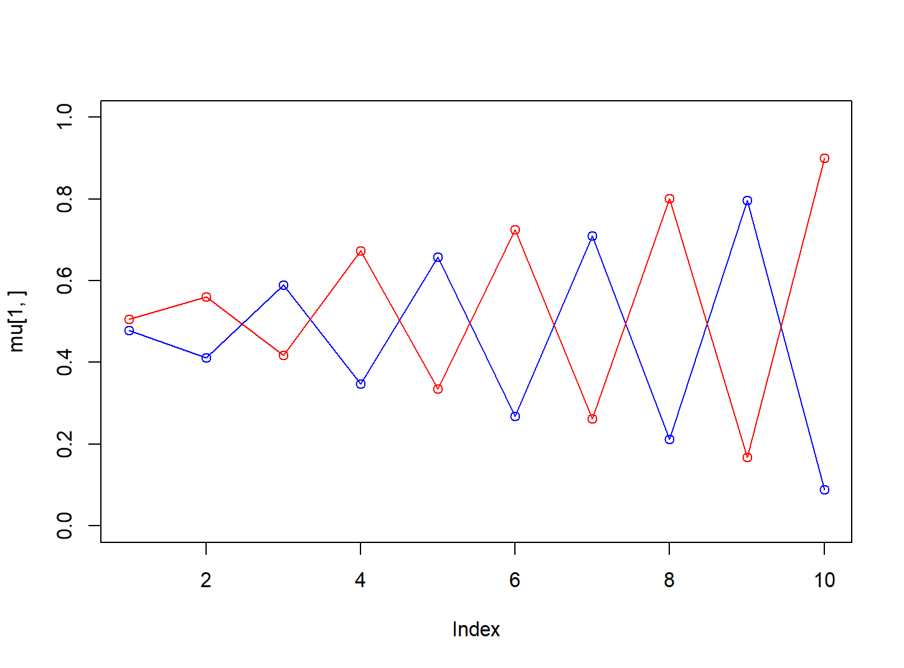
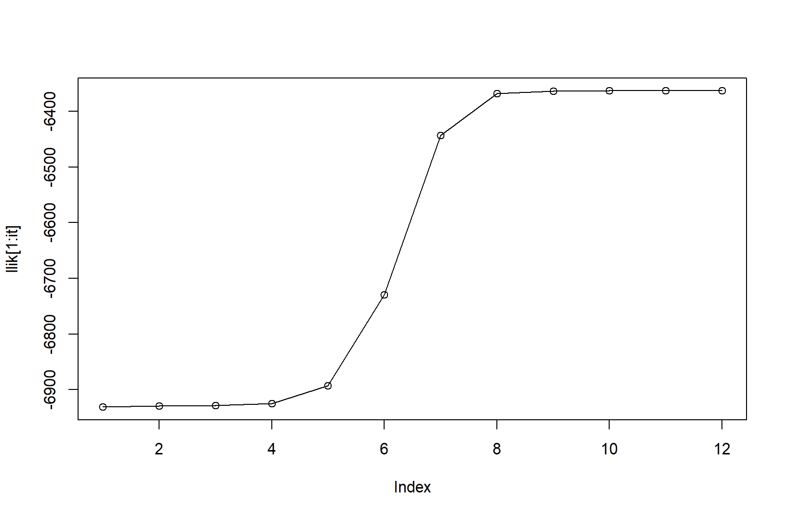
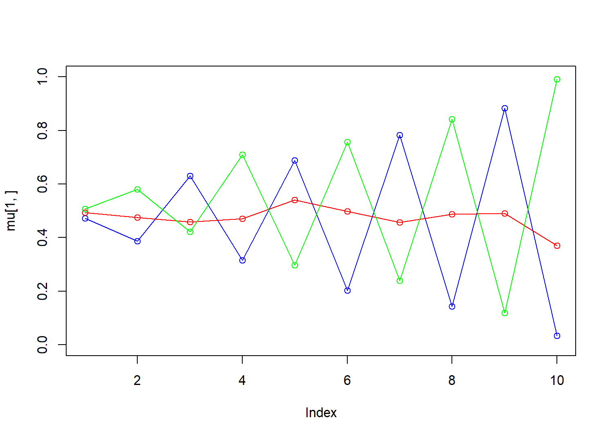
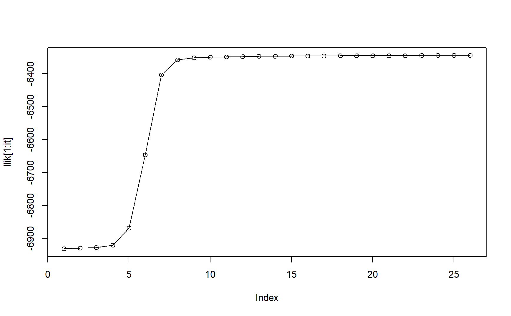
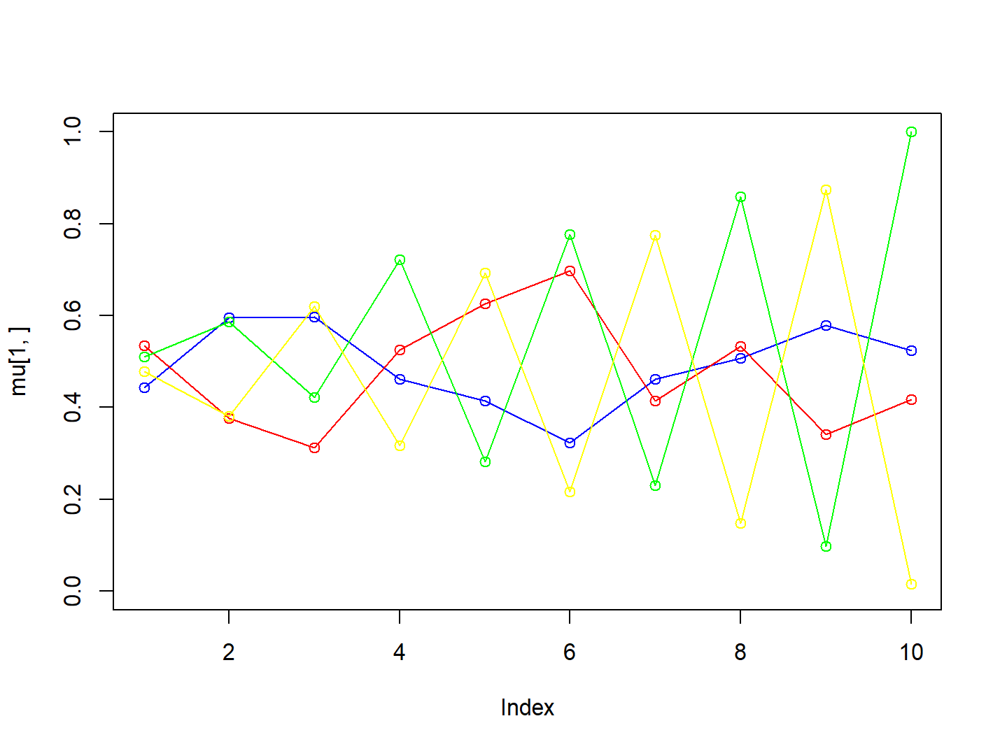
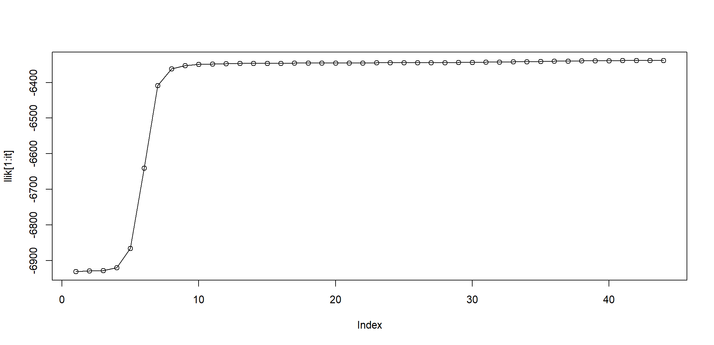

```{r setup, include=FALSE}
knitr::opts_chunk$set(echo = TRUE)
```

# Statement of Contribution

The contributions are distributed as follows:

Qingxuan Cui: Worked on assignment 1 and question 1 in assignment 4,
with sharing and discussing the results.

Yanjie Lyu: Worked on assignment 2 (Mathematical derivation, and part of
coding) and question 3 from assignment 4. 

Yi Yang: Worked on assignment 2 (Part of
coding and analysis) and question 2 from assignment 4.

After completing their respective assignments(including code writing and
analysis), all results were shared and thoroughly discussed among the
three members.

```{r , include=FALSE}
set.seed(1234567890)
max_it <- 100 # max number of EM iterations
min_change <- 0.1 # min change in log lik between two consecutive iterations
n=1000 # number of training points
D=10 # number of dimensions
x <- matrix(nrow=n, ncol=D) # training data
true_pi <- vector(length = 3) # true mixing coefficients
true_mu <- matrix(nrow=3, ncol=D) # true conditional distributions
true_pi=c(1/3, 1/3,1/3)
true_mu[1,]=c(0.5,0.6,0.4,0.7,0.3,0.8,0.2,0.9,0.1,1)
true_mu[2,]=c(0.5,0.4,0.6,0.3,0.7,0.2,0.8,0.1,0.9,0)
true_mu[3,]=c(0.5,0.5,0.5,0.5,0.5,0.5,0.5,0.5,0.5,0.5)

plot(true_mu[1,], type="o", col="blue", ylim=c(0,1))
points(true_mu[2,], type="o", col="red")
points(true_mu[3,], type="o", col="green")

# Producing the training data
for(i in 1:n) {
  m <- sample(1:3,1,prob=true_pi)
  for(d in 1:D) {
    x[i,d] <- rbinom(1,1,true_mu[m,d])
  }
}

M=2 # number of clusters
w <- matrix(nrow=n, ncol=M) # weights
pi <- vector(length = M) # mixing coefficients
mu <- matrix(nrow=M, ncol=D) # conditional distributions
llik <- vector(length = max_it) # log likelihood of the EM iterations

# Random initialization of the parameters
pi <- runif(M,0.49,0.51)
pi <- pi / sum(pi)
for(m in 1:M) {
  mu[m,] <- runif(D,0.49,0.51)
}
pi
mu
for(it in 1:max_it) {
  plot(mu[1,], type="o", col="blue", ylim=c(0,1))
  points(mu[2,], type="o", col="red")
  #points(mu[3,], type="o", col="green")
  #points(mu[4,], type="o", col="yellow")
  Sys.sleep(0.5)
  # E-step: Computation of the weights
  

  
  p_x <- numeric(length = n)
  for (i in 1:n) {
    pi_bern <- numeric(M)  
    Bern <- rep(1, M) 
    max_Bern <- 0
    for (m in 1:M){
      Bern[m] <- 1
      for (j in 1:D) {
        if(x[i,j]==1){
          Bern[m] <- Bern[m]*mu[m,j]
        }else{Bern[m] <- Bern[m]*(1-mu[m,j])}
      }
      pi_bern[m] <- pi[m]*Bern[m]
      p_x[i] <- p_x[i] + pi_bern[m]
    }
    for (m in 1:M) {
      w[i,m] <- pi_bern[m]/p_x[i]
    }
    
  }
  
  
  
  #Log likelihood computation.
  
  log_p_x <- log(p_x)
  llik[it] <- sum(log_p_x)
  
  cat("iteration: ", it, "log likelihood: ", llik[it], "\n")
  flush.console()
  # Stop if the lok likelihood has not changed significantly
  
  if(it > 1 && abs(llik[it] - llik[it - 1]) <= min_change){
    print(it)
    break
  }
  
  #M-step: ML parameter estimation from the data and weights
  for (m in 1:M) {
    N_m <- sum(w[,m])
    pi[m] <- N_m / n
    for (d in 1:D) {
      mu[m,d] <- sum(w[,m] * x[,d]) / N_m
    }
    
  }
}

cat("The result of pi is: ","\n")
pi
cat("The result of mu is :","\n")
mu
plot(llik[1:it], type="o")
cat("\n")
```

```{r, include = FALSE}
generateTrainData = function(condition){
  x1 = runif(100)
  x2 = runif(100)
  trdata = cbind(x1,x2)
  y = as.numeric(eval(parse(text = condition)))
  trlabels = as.factor(y)
  return(cbind(trdata, trlabels))
}

generateTestData = function(condition){
  set.seed(1234)
  x1 = runif(1000)
  x2 = runif(1000)
  tedata = cbind(x1,x2)
  y = as.numeric(eval(parse(text = condition)))
  telabels = as.factor(y)
  return(cbind(tedata, telabels))
}

library(randomForest)

trainFor3000Times = function(node_size, condition){
  test_data = generateTestData(condition)
  test_data[,3] = as.factor(test_data[,3])
  ntrees = c(1, 10, 100)
  rf_list = list()
  mes = vector()
  # mean_error_list = list()
  # var_error_list = list()
  eval_list = list()
  eval = list()
  for (j in 1:3){
    for(i in 1:1000){
      train_data = generateTrainData(condition)
      rf = randomForest(as.factor(trlabels)~., data = train_data, ntrees = ntrees[j], nodesize = node_size, keep.forest = TRUE)
      output = predict(rf, newdata = test_data)
      me = mean(output != test_data[,3])
      mes = c(me, mes)
    }
    # report here
    trees = ntrees[j]
    mean_error = mean(mes)
    var_error = var(mes)
    eval$mean = mean_error
    eval$var = var_error
    eval_list[[as.character(trees)]] = eval
    # mean_error_list[[as.character(trees)]] =  mean_error
    cat(trees, " trees:\n")
    cat("Mean of misclassification error: ", mean_error, "\n")
    cat("Variance of misclassification error: ", var_error, "\n")
  }
  return(eval_list)
}

# 
# cat("Node Size = 25     Condition: x1<x2\n")
# eval1  = trainFor3000Times(node_size = 25, condition = "x1<x2")
# cat("Node Size = 12     Condition: x1<0.5\n")
# eval2 = trainFor3000Times(node_size = 12, condition = "x1<0.5")
# cat("Node Size = 12     Condition: (x1<0.5 & x2<0.5)|(x1>0.5 & x2>0.5)\n")
# eval3 = trainFor3000Times(node_size = 12, condition = "(x1<0.5 & x2<0.5)|(x1>0.5 & x2>0.5)")
```
\clearpage
# Assignment 1

## Train Random Forest models with different hyperparameters and dataset

```{r, echo=FALSE}
library(knitr)

df = data.frame(
  node_size = c(25,25,25,12,12,12,12,12,12),
  condition = c("x1<x2","Ditto", "Ditto","x1<0.5","Ditto","Ditto", "(x1<0.5 & x2<0.5)|(x1>0.5 & x2>0.5)","Ditto","Ditto"),
  trees = c(1,10,100,1,10,100,1,10,100),
  mean = c(0.10967,0.10938, 0.10923,0.006055,0.006074,0.006091,0.0730,0.0726,0.0725),
  var = c(8.8e-04,8.8e-04,8.7e-04,4.5e-05,4.7e-05,4.7e-05,1.3e-03,1.2e-03,1.2e-03)
)

kable(df, col.names = c("Node Size", "Condition", "Number of Trees", "Error Mean", "Error Variance")) 
```

## Answer for following questions

### What happens with the mean error rate when the number of trees in the random forest grows? Why?

Among 3 different condition to generate label, the first one and the
third one have the same trend that mean values decrease in their changes
of mean classification error, with increase of node size, while the mean
value for the second one increase slightly. I think the second one is a
case, thus, we can conclude that, with node size increasing, the
classification error decreases generally. As for reason, I think the
prime one is that a bigger "forest" represents that data can be sampled
for more times, subsequently we can acquire more base models trained by
bootstrapped data sets, which are different after uniformly sampling. In
that case, model can learn the feature from more different combinations
of data subset, making the model less sensitive to outliers and noise.

### The model trained with third dataset should get better performance than the first one. Why?

Certainly, the third model have better performance with much smaller
mean classification error. However, based on my instinct, the third
condition is more complicated therefore the condition should be found
more difficultly. Whereas, the crux is that the third model set a
smaller value about node size, in this case, the tree can split the data
set for more times until the node size is less than node_size, which
means the trees in third random forest model is deeper, and we can know
that a deeper tree can catch more complicated relation between label and
input data.

# Assignment 2

## Set M=2,3,4,the results show as follows

### Set M=2,the results show as follows:

```{r include=FALSE}
library(knitr)
```

```{r echo=FALSE}
cat(" The number of iteration is : ", it, "\n")
cat(" The value of log likelihood: ", llik[it], "\n")
```

```{r echo=FALSE, fig.cap="A.2.1: Value of mu after iterations with 2 clusters", out.width="60%",fig.align='center'}

```

```{r echo=FALSE, fig.cap="A.2.2: Value of log likelihood duiring iterations with 2 clusters", out.width="60%",fig.align='center'}

```

```{r echo=FALSE}
cat("The result of pi is: ","\n")
pi
cat("The result of mu is :","\n")
mu
```

```{r , include=FALSE}
set.seed(1234567890)
max_it <- 100 # max number of EM iterations
min_change <- 0.1 # min change in log lik between two consecutive iterations
n=1000 # number of training points
D=10 # number of dimensions
x <- matrix(nrow=n, ncol=D) # training data
true_pi <- vector(length = 3) # true mixing coefficients
true_mu <- matrix(nrow=3, ncol=D) # true conditional distributions
true_pi=c(1/3, 1/3, 1/3)
true_mu[1,]=c(0.5,0.6,0.4,0.7,0.3,0.8,0.2,0.9,0.1,1)
true_mu[2,]=c(0.5,0.4,0.6,0.3,0.7,0.2,0.8,0.1,0.9,0)
true_mu[3,]=c(0.5,0.5,0.5,0.5,0.5,0.5,0.5,0.5,0.5,0.5)
plot(true_mu[1,], type="o", col="blue", ylim=c(0,1))
points(true_mu[2,], type="o", col="red")
points(true_mu[3,], type="o", col="green")

# Producing the training data
for(i in 1:n) {
  m <- sample(1:3,1,prob=true_pi)
  for(d in 1:D) {
    x[i,d] <- rbinom(1,1,true_mu[m,d])
  }
}

M=3 # number of clusters
w <- matrix(nrow=n, ncol=M) # weights
pi <- vector(length = M) # mixing coefficients
mu <- matrix(nrow=M, ncol=D) # conditional distributions
llik <- vector(length = max_it) # log likelihood of the EM iterations

# Random initialization of the parameters
pi <- runif(M,0.49,0.51)
pi <- pi / sum(pi)
for(m in 1:M) {
  mu[m,] <- runif(D,0.49,0.51)
}
pi
mu
for(it in 1:max_it) {
  plot(mu[1,], type="o", col="blue", ylim=c(0,1))
  points(mu[2,], type="o", col="red")
  points(mu[3,], type="o", col="green")
  #points(mu[4,], type="o", col="yellow")
  Sys.sleep(0.5)
  # E-step: Computation of the weights
  
  #Bern <- vector(length = n)
  #epsilon <- 1e-10
  #mu <- pmax(mu, epsilon)
  #mu <- pmin(mu, 1 - epsilon)
  
  p_x <- numeric(length = n)
  for (i in 1:n) {
    pi_bern <- numeric(M)  
    Bern <- rep(1, M) 
    max_Bern <- 0
    for (m in 1:M){
      Bern[m] <- 1
      for (j in 1:D) {
        if(x[i,j]==1){
          Bern[m] <- Bern[m]*mu[m,j]
        }else{Bern[m] <- Bern[m]*(1-mu[m,j])}
      }
      pi_bern[m] <- pi[m]*Bern[m]
      p_x[i] <- p_x[i] + pi_bern[m]
    }
    for (m in 1:M) {
      w[i,m] <- pi_bern[m]/p_x[i]
    }
    
  }
  
  
  
  #Log likelihood computation.
  
  log_p_x <- log(p_x)
  llik[it] <- sum(log_p_x)
  
  cat("iteration: ", it, "log likelihood: ", llik[it], "\n")
  flush.console()
  # Stop if the lok likelihood has not changed significantly
  
  if(it > 1 && abs(llik[it] - llik[it - 1]) <= min_change){
    print(it)
    break
  }
  
  
  
  #M-step: ML parameter estimation from the data and weights
  for (m in 1:M) {
    N_m <- sum(w[,m])
    pi[m] <- N_m / n
    for (d in 1:D) {
      mu[m,d] <- sum(w[,m] * x[,d]) / N_m
    }
    
  }
}


pi
mu
plot(llik[1:it], type="o")
```

### Set M=3, the results show as follows:

```{r echo=FALSE}

cat(" The number of iteration is : ", it, "\n")
cat(" The value of log likelihood: ", llik[it], "\n")
```

```{r echo=FALSE, fig.cap="A.2.3: Value of mu after iterations with 3 clusters", out.width="60%",fig.align='center'}

```

```{r echo=FALSE, fig.cap="A.2.4: Value of log likelihood duiring iterations with 3 clusters", out.width="60%",fig.align='center'}


```

```{r echo=FALSE}

cat("The result of pi is: ","\n")
pi
cat("The result of mu is :","\n")
mu
```

```{r , include=FALSE}
set.seed(1234567890)
max_it <- 100 # max number of EM iterations
min_change <- 0.1 # min change in log lik between two consecutive iterations
n=1000 # number of training points
D=10 # number of dimensions
x <- matrix(nrow=n, ncol=D) # training data
true_pi <- vector(length = 3) # true mixing coefficients
true_mu <- matrix(nrow=3, ncol=D) # true conditional distributions
true_pi=c(1/3, 1/3, 1/3)
true_mu[1,]=c(0.5,0.6,0.4,0.7,0.3,0.8,0.2,0.9,0.1,1)
true_mu[2,]=c(0.5,0.4,0.6,0.3,0.7,0.2,0.8,0.1,0.9,0)
true_mu[3,]=c(0.5,0.5,0.5,0.5,0.5,0.5,0.5,0.5,0.5,0.5)
plot(true_mu[1,], type="o", col="blue", ylim=c(0,1))
points(true_mu[2,], type="o", col="red")
points(true_mu[3,], type="o", col="green")

# Producing the training data
for(i in 1:n) {
  m <- sample(1:3,1,prob=true_pi)
  for(d in 1:D) {
    x[i,d] <- rbinom(1,1,true_mu[m,d])
  }
}

M=4 # number of clusters
w <- matrix(nrow=n, ncol=M) # weights
pi <- vector(length = M) # mixing coefficients
mu <- matrix(nrow=M, ncol=D) # conditional distributions
llik <- vector(length = max_it) # log likelihood of the EM iterations

# Random initialization of the parameters
pi <- runif(M,0.49,0.51)
pi <- pi / sum(pi)
for(m in 1:M) {
  mu[m,] <- runif(D,0.49,0.51)
}
pi
mu
for(it in 1:max_it) {
  plot(mu[1,], type="o", col="blue", ylim=c(0,1))
  points(mu[2,], type="o", col="red")
  points(mu[3,], type="o", col="green")
  points(mu[4,], type="o", col="yellow")
  Sys.sleep(0.1)
  # E-step: Computation of the weights
 
  
  p_x <- numeric(length = n)
  for (i in 1:n) {
    pi_bern <- numeric(M)  
    Bern <- rep(1, M) 
    max_Bern <- 0
    for (m in 1:M){
      Bern[m] <- 1
      for (j in 1:D) {
        if(x[i,j]==1){
          Bern[m] <- Bern[m]*mu[m,j]
        }else{Bern[m] <- Bern[m]*(1-mu[m,j])}
      }
      pi_bern[m] <- pi[m]*Bern[m]
      p_x[i] <- p_x[i] + pi_bern[m]
    }
    for (m in 1:M) {
      w[i,m] <- pi_bern[m]/p_x[i]
    }
    
  }
  
  
  
  #Log likelihood computation.
  
  log_p_x <- log(p_x)
  llik[it] <- sum(log_p_x)
  
  cat("iteration: ", it, "log likelihood: ", llik[it], "\n")
  flush.console()
  # Stop if the lok likelihood has not changed significantly
  
  if(it > 1 && abs(llik[it] - llik[it - 1]) <= min_change){
    print(it)
    break
  }
  
  
  
  #M-step: ML parameter estimation from the data and weights
  for (m in 1:M) {
    N_m <- sum(w[,m])
    pi[m] <- N_m / n
    for (d in 1:D) {
      mu[m,d] <- sum(w[,m] * x[,d]) / N_m
    }
    
  }
}


pi
mu

plot(llik[1:it], type="o")
```

### Set M=4, the results show as follows:

```{r echo=FALSE}
cat(" The number of iteration is : ", it, "\n")
cat(" The value of log likelihood: ", llik[it], "\n")
```

```{r echo=FALSE, fig.cap="A.2.5: Value of mu after iterations with 4 clusters", out.width="60%",fig.align='center'}

```

```{r echo=FALSE, fig.cap="A.2.6: Value of log likelihood duiring iterations with 4 clusters", out.width="60%",fig.align='center'}


```

```{r echo=FALSE}

cat("The result of pi is: ","\n")
pi
cat("The result of mu is :","\n")
mu
```

## Compare results

Case of M = 2 : The log-likelihood value(-6362.897) is lower than M=3
and M=4, which shows that the model is relatively simple to capture the
features of the data. The number of iterations(12) shows that it
converges quickly but to a poor local optimal.

Case of M = 3 : The log-likelihood value(-6344.5) shows a significant
improvement compared to M =2, which indicates the model fits the true
distribution of the data more accurately. The number of iterations(26)
shows a better balance between model complexity and model performance.

Case of M = 4 : The log-likelihood value(-6338.288) improves slightly
compared to M =3,which means it does not show a significant improvement.
The number of iterations(44) indicates increased model complexity
complex to M=3, which may result in overfitting and the model may
capture noise in the data.

Conclusion: A mixture model has too few clusters (e.g.,M=2 in this case)
may lead to underfitting and can not capture necessary features from the
data.On the contrary, a mixture with too many clusters(e.g.,M=4 in this
case) may lead to excessive model complexity with little model
performance. And clustering is not necessarily the case to minimize the
" clustering loss", so we may perfer a smaller model(e.g.,M=3 in this
case) over a large one even if the latter shows a slightly better
log-likelihood.

# Assignment 3 Theory

## Impact of Ensemble Size (B) on Model Flexibility

My answer is no:

Flexibility means the model would be more complex to cope with some
complicated data, which also means that it would be overfitted when B is
big enough. (Bias tend to be smaller in train data and variance boom in
test data) But actually we can see the effects after increasing B, based
on the mean and variance:

$$
\mathbb{E} \left[ \frac{1}{B} \sum_{b=1}^B z_b \right] = \mu,
$$ $$
\text{Var} \left[ \frac{1}{B} \sum_{b=1}^B z_b \right] = \frac{1-\rho}{B}\sigma^2 + \rho \sigma^2.
$$

Generally spkeaing, the variance would decrease while the bias remains.
Summarize, there is no evidence representing the model would be flexible
after B increasing.(P169)

## The loss function used to train the boosted classifier at each iteration.

$$
L(y \cdot f(x)) = \exp(-y \cdot f(x))
$$ where $$ y\cdot f(x)$$ is the margin of the classifier. The ensemble
members are added one at a time, and when member b is added, this is
done to minimise the exponential loss of the entire ensemble. The reason
why we choose the exponential loss is because it results in convenient
closed form expressions. (page 177)

## Use cross-validation to select the number of clusters

Data is split into K folds, and the model is trained on K-1 folds while
leaving one fold out as a validation set. For each candidate value of M,
we compute the average log-likelihood across all validation folds:

$$
\frac{1}{K} \sum_{k=1}^{K} \log p\left(\{x'_j\}_{j=1}^{n_k} \mid \hat{\theta}_k, M\right),
$$ The model with the largest average validation log-likelihood is then
selected as the final clustering model with its optimal number of
components M. (page 267)

# Appendix

## Code for assignment 1

```{r, echo=TRUE, eval=FALSE}
generateTrainData = function(condition){
  x1 = runif(100)
  x2 = runif(100)
  trdata = cbind(x1,x2)
  y = as.numeric(eval(parse(text = condition)))
  trlabels = as.factor(y)
  return(cbind(trdata, trlabels))
}

generateTestData = function(condition){
  set.seed(1234)
  x1 = runif(1000)
  x2 = runif(1000)
  tedata = cbind(x1,x2)
  y = as.numeric(eval(parse(text = condition)))
  telabels = as.factor(y)
  return(cbind(tedata, telabels))
}

library(randomForest)

trainFor3000Times = function(node_size, condition){
  test_data = generateTestData(condition)
  test_data[,3] = as.factor(test_data[,3])
  ntrees = c(1, 10, 100)
  rf_list = list()
  mes = vector()
  # mean_error_list = list()
  # var_error_list = list()
  eval_list = list()
  eval = list()
  for (j in 1:3){
    for(i in 1:1000){
      train_data = generateTrainData(condition)
      rf = randomForest(as.factor(trlabels)~., data = train_data, ntrees = ntrees[j], nodesize = node_size, keep.forest = TRUE)
      output = predict(rf, newdata = test_data)
      me = mean(output != test_data[,3])
      mes = c(me, mes)
    }
    # report here
    trees = ntrees[j]
    mean_error = mean(mes)
    var_error = var(mes)
    eval$mean = mean_error
    eval$var = var_error
    eval_list[[as.character(trees)]] = eval
    # mean_error_list[[as.character(trees)]] =  mean_error
    cat(trees, " trees:\n")
    cat("Mean of misclassification error: ", mean_error, "\n")
    cat("Variance of misclassification error: ", var_error, "\n")
  }
  return(eval_list)
}

cat("Node Size = 25     Condition: x1<x2\n")
eval1  = trainFor3000Times(node_size = 25, condition = "x1<x2")
cat("Node Size = 12     Condition: x1<0.5\n")
eval2 = trainFor3000Times(node_size = 12, condition = "x1<0.5")
cat("Node Size = 12     Condition: (x1<0.5 & x2<0.5)|(x1>0.5 & x2>0.5)\n")
eval3 = trainFor3000Times(node_size = 12, condition = "(x1<0.5 & x2<0.5)|(x1>0.5 & x2>0.5)")
```

## code for assignment 2

```{r , echo=TRUE,eval=FALSE}
set.seed(1234567890)
max_it <- 100 # max number of EM iterations
min_change <- 0.1 # min change in log lik between two consecutive iterations
n=1000 # number of training points
D=10 # number of dimensions
x <- matrix(nrow=n, ncol=D) # training data
true_pi <- vector(length = 3) # true mixing coefficients
true_mu <- matrix(nrow=3, ncol=D) # true conditional distributions
true_pi=c(1/3, 1/3, 1/3)
true_mu[1,]=c(0.5,0.6,0.4,0.7,0.3,0.8,0.2,0.9,0.1,1)
true_mu[2,]=c(0.5,0.4,0.6,0.3,0.7,0.2,0.8,0.1,0.9,0)
true_mu[3,]=c(0.5,0.5,0.5,0.5,0.5,0.5,0.5,0.5,0.5,0.5)
plot(true_mu[1,], type="o", col="blue", ylim=c(0,1))
points(true_mu[2,], type="o", col="red")
points(true_mu[3,], type="o", col="green")

# Producing the training data
for(i in 1:n) {
  m <- sample(1:3,1,prob=true_pi)
  for(d in 1:D) {
    x[i,d] <- rbinom(1,1,true_mu[m,d])
  }
}

M=3 # number of clusters
#M=2
#M=4
w <- matrix(nrow=n, ncol=M) # weights
pi <- vector(length = M) # mixing coefficients
mu <- matrix(nrow=M, ncol=D) # conditional distributions
llik <- vector(length = max_it) # log likelihood of the EM iterations

# Random initialization of the parameters
pi <- runif(M,0.49,0.51)
pi <- pi / sum(pi)
for(m in 1:M) {
  mu[m,] <- runif(D,0.49,0.51)
}
pi
mu
for(it in 1:max_it) {
  plot(mu[1,], type="o", col="blue", ylim=c(0,1))
  points(mu[2,], type="o", col="red")
  points(mu[3,], type="o", col="green")
  #points(mu[4,], type="o", col="yellow")
  Sys.sleep(0.5)
  # E-step: Computation of the weights
  
  #Bern <- vector(length = n)
  #epsilon <- 1e-10
  #mu <- pmax(mu, epsilon)
  #mu <- pmin(mu, 1 - epsilon)
  
  p_x <- numeric(length = n)
  for (i in 1:n) {
    pi_bern <- numeric(M)  
    Bern <- rep(1, M) 
    max_Bern <- 0
    for (m in 1:M){
      Bern[m] <- 1
      for (j in 1:D) {
        if(x[i,j]==1){
          Bern[m] <- Bern[m]*mu[m,j]
        }else{Bern[m] <- Bern[m]*(1-mu[m,j])}
      }
      pi_bern[m] <- pi[m]*Bern[m]
      p_x[i] <- p_x[i] + pi_bern[m]
    }
    for (m in 1:M) {
      w[i,m] <- pi_bern[m]/p_x[i]
    }
    
  }
  
  
  
  #Log likelihood computation.
  
  log_p_x <- log(p_x)
  llik[it] <- sum(log_p_x)
  
  cat("iteration: ", it, "log likelihood: ", llik[it], "\n")
  flush.console()
  # Stop if the lok likelihood has not changed significantly
  
  if(it > 1 && abs(llik[it] - llik[it - 1]) <= min_change){
    print(it)
    break
  }
  
  
  
  #M-step: ML parameter estimation from the data and weights
  for (m in 1:M) {
    N_m <- sum(w[,m])
    pi[m] <- N_m / n
    for (d in 1:D) {
      mu[m,d] <- sum(w[,m] * x[,d]) / N_m
    }
    
  }
}


pi
mu
plot(llik[1:it], type="o")
```
