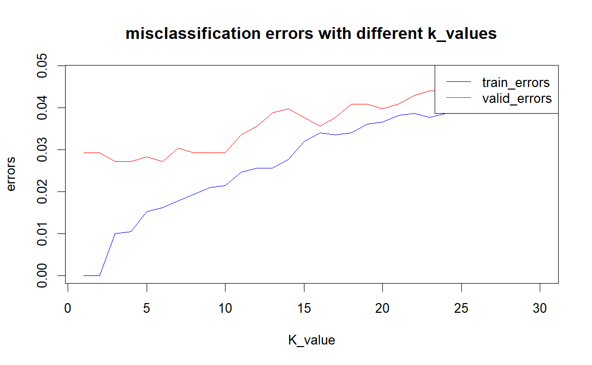
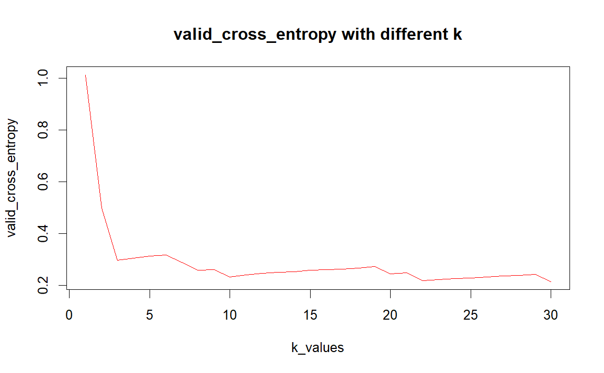
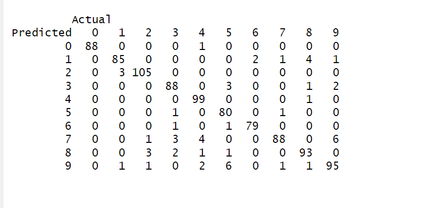
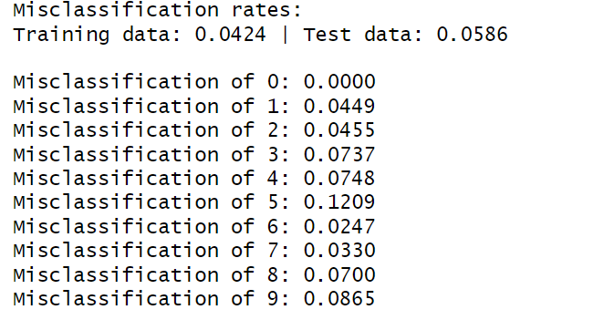
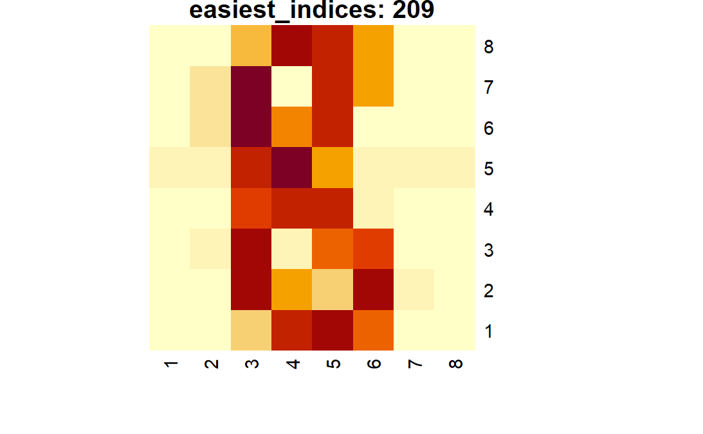
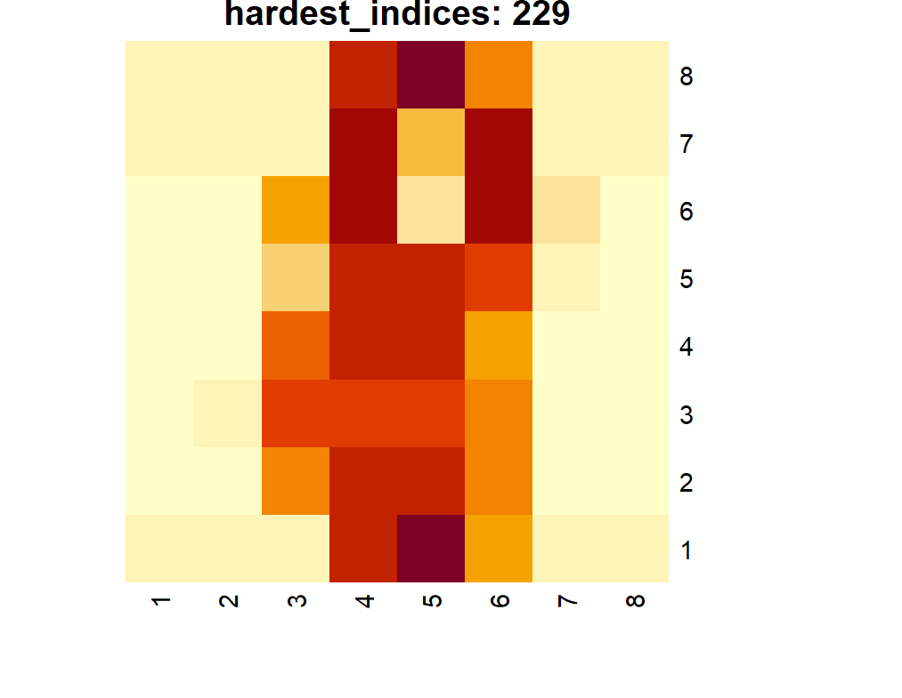

```{r setup, include=FALSE}
knitr::opts_chunk$set(echo = TRUE)
```

```{r include=FALSE}
library(kknn)
data <- read.csv("optdigits.csv", header = TRUE)  
data$X0.26 <- as.factor(data$X0.26)
n <- nrow(data)
set.seed(12345)
id <- sample(1:n,floor(n*0.5))
train <- data[id,]

valid_test <- data[-id,]
id_2 <- sample(1:nrow(valid_test),floor(nrow(valid_test)*0.5))
valid <- valid_test[id_2,]
test <- valid_test[-id_2,]

train_model <- kknn(X0.26~.,train,train,k=30,kernel = "rectangular")
train_predictions <- fitted(train_model)
test_model <- kknn(X0.26~.,train,test,k=30,kernel = "rectangular")
test_predictions <- fitted(test_model)

train_confusion_matrix <- table(Predicted = train_predictions, Actual = train$X0.26)
test_confusion_matrix <- table(Predicted = test_predictions, Actual = test$X0.26)

misclassification_train <- 1 - sum(diag(train_confusion_matrix)) / sum(train_confusion_matrix)

misclassification_test <- 1 - sum(diag(test_confusion_matrix)) / sum(test_confusion_matrix)


train_prob <- train_model$prob
index_eight <- which(train$X0.26 == "8")
prob_eight <- train_prob[index_eight, "8"]

ordered_indices <- order(prob_eight, decreasing = TRUE)
easiest_indices <- index_eight[ordered_indices[1:2]]

n <- length(ordered_indices)
hardest_indices <- index_eight[ordered_indices[(n-2):n]]


feature_columns <- setdiff(names(train), "X0.26")

easiest_features_1 <-  as.numeric(train[easiest_indices[1], feature_columns])
easiest_features_2 <-  as.numeric(train[easiest_indices[2], feature_columns])
hardest_features_1 <-  as.numeric(train[hardest_indices[1], feature_columns])
hardest_features_2 <-  as.numeric(train[hardest_indices[2], feature_columns])
hardest_features_3 <-  as.numeric(train[hardest_indices[3], feature_columns])

digit_matrix_easy_1 <- matrix(easiest_features_1, nrow = 8, ncol = 8, byrow = TRUE)
digit_matrix_easy_2 <- matrix(easiest_features_2, nrow = 8, ncol = 8, byrow = TRUE)
digit_matrix_hard_1 <- matrix(hardest_features_1, nrow = 8, ncol = 8, byrow = TRUE)
digit_matrix_hard_2 <- matrix(hardest_features_2, nrow = 8, ncol = 8, byrow = TRUE)
digit_matrix_hard_3 <- matrix(hardest_features_3, nrow = 8, ncol = 8, byrow = TRUE)

heatmap(digit_matrix_easy_1, Colv = NA, Rowv = NA, 
        main = paste("easiest_indices:",easiest_indices[1] ))
heatmap(digit_matrix_easy_2, Colv = NA, Rowv = NA, 
        main = paste("easiest_indices:",easiest_indices[2] ))
heatmap(digit_matrix_hard_1, Colv = NA, Rowv = NA, 
        main = paste("hardest_indices:",hardest_indices[1] ))
heatmap(digit_matrix_hard_2, Colv = NA, Rowv = NA, 
        main = paste("hardest_indices:",hardest_indices[2] ))
heatmap(digit_matrix_hard_3, Colv = NA, Rowv = NA, 
        main = paste("hardest_indices:",hardest_indices[3] ))

k_values <- c(1:30)
train_errors <- numeric(length(k_values))
valid_errors <- numeric(length(k_values))

for (i in k_values) {
  model <- kknn(X0.26 ~ ., train = train, test = train, k = i, kernel = "rectangular")
  pred_train <- fitted(model)
  train_cm <- table(Predicted = pred_train, Actual = train$X0.26)
  train_errors[i] <- 1 - sum(diag(train_cm)) / sum(train_cm)

  model_valid <- kknn(X0.26 ~ ., train = train, test = valid, k = i, kernel = "rectangular")
  pred_valid <- fitted(model_valid)
  valid_cm <- table(Predicted = pred_valid, Actual = valid$X0.26)
  valid_errors[i] <- 1 - sum(diag(valid_cm)) / sum(valid_cm)
}

plot(k_values, train_errors, type = "l", col = "blue", ylim = c(0, max(c(train_errors, valid_errors))),
     xlab = "K_value", ylab = "errors", main = "errors with different k_values")
lines(k_values, valid_errors, type = "l", col = "red")
legend("topright", legend = c("train_errors", "valid_errors"), col = c("blue", "red"), lty = 1)

optimal_K <- which.min(valid_errors)

final_model <- kknn(X0.26 ~ ., train = train, test = test, k = optimal_K, kernel = "rectangular")
pred_test <- fitted(final_model)
test_cm <- table(Predicted = pred_test, Actual = test$X0.26)
test_error <- 1 - sum(diag(test_cm)) / sum(test_cm)


#5

valid_cross_entropy <- numeric(length(k_values))
class_levels <- levels(train$X0.26)
for (i in k_values) {
  model <- kknn(X0.26 ~ ., train = train, test = valid, k = i, kernel = "rectangular")
  prob_matrix <- model$prob
  
  epsilon <- 1e-15
  prob_matrix <- pmax(prob_matrix, epsilon)
  prob_matrix <- pmin(prob_matrix, 1 - epsilon)
  
  actual_classes <- as.numeric(valid$X0.26)
  
  N <- nrow(valid)
  cross_entropy <- 0
  for (j in 1:N) {
    class_index <- actual_classes[j]
    prob <- prob_matrix[j, class_index]
    cross_entropy <- cross_entropy - log(prob)
  }
  valid_cross_entropy[i] <- cross_entropy / N
}
plot(k_values, valid_cross_entropy, type = "l", col = "red",
     xlab = "k_values", ylab = "valid_cross_entropy", main = "valid_cross_entropy with different k")

min_value <- min(valid_cross_entropy)
threshold <- min_value * 1.1
first_stable_k <- which(valid_cross_entropy <= threshold)[1]

```

# Assignment 1

## Comment on the quality of predictions for different digits and on the overall prediction quality.

```{r echo=FALSE}
print(test_confusion_matrix)
```

```{r echo=FALSE}
cat("Misclassification rates:\n")
cat(sprintf("Training data: %.4f | Test data: %.4f\n\n", misclassification_train, misclassification_test))

for (i in 0:9) {
  misclassification_test <- 1 - max(test_confusion_matrix[, i + 1]) / sum(test_confusion_matrix[, i + 1])
  cat(sprintf("Misclassification of %d: %.4f\n", i, misclassification_test))
}

```

According to the misclassification rate of test data, the model performs best on number "0", but there is a high rate on number "5","8",and "9".

The overall misclassification rates of training data and test data are 0.04238619 and 0.05857741, which is acceptable.

Overall Performance: The model performs well with low misclassification rates and generalizes effectively across training and test sets.

## cases of digit “8”

```{r echo=FALSE}
heatmap(digit_matrix_easy_2, Colv = NA, Rowv = NA, 
        main = paste("easiest_indices:",easiest_indices[2] ))

heatmap(digit_matrix_hard_2, Colv = NA, Rowv = NA, 
        main = paste("hardest_indices:",hardest_indices[2] ))

```

Index 209 is the easiest one to be recognized. Index 1663 can barely make out the shape of eight.

## Fit a K-nearest neighbor classifiers with misclassification errors

[{width="405"}](%22E:\Programe__AA\ML_lab\lab1\000014.png%22)

1.As the value of K increases, the model becomes less sensitive, i.e. the model complexity decreases. Smaller K values result in a more complex model (sensitive to noise), while larger K values make the model smoother (potentially resulting in underfitting).

2.The training error rate curve increases with the increase of K. With the increase of K, the validation error rate curve first decreases, reaches a lowest point (the best value k), and then may slightly increase or become stable.

### test error compared with training and valid error

```{r echo=FALSE}
cat("the test error is:", test_error,"\n")
cat("the training error is:", train_errors[3],"\n")
cat("the validation error is:", valid_errors[3],"\n")
```

The classification error rate of the model on training, verification and test sets is low, and the difference is not large, indicating that the model has consistent performance on different data sets.

# Fit K-nearest neighbor classifiers with cross-entropy

[{width="406"}](%22E:\Programe__AA\ML_lab\lab1\000010.png%22)

```{r echo=FALSE}
cat("the optimal value of K is:",first_stable_k,"\n" )
```

For multiple classification problems, cross entropy can reflect the degree of confidence of the model in predicting the correct category.

The misclassification rate only considers correct or incorrect classifications, but the cross-entropy is more sensitive to the probabilistic output of the model and therefore reflects the performance of the model in more detail. If a model misclassifies, but the probability of prediction is very close to the correct answer, the increase in cross entropy loss will be smaller than the misclassification rate, reflecting a more nuanced error situation.

# Appendix

```{r, echo=TRUE, eval=FALSE}
library(kknn)
data <- read.csv("optdigits.csv", header = TRUE)  
data$X0.26 <- as.factor(data$X0.26)
n <- nrow(data)
set.seed(12345)
id <- sample(1:n,floor(n*0.5))
train <- data[id,]

valid_test <- data[-id,]
id_2 <- sample(1:nrow(valid_test),floor(nrow(valid_test)*0.5))
valid <- valid_test[id_2,]
test <- valid_test[-id_2,]

train_model <- kknn(X0.26~.,train,train,k=30,kernel = "rectangular")
train_predictions <- fitted(train_model)
test_model <- kknn(X0.26~.,train,test,k=30,kernel = "rectangular")
test_predictions <- fitted(test_model)

train_confusion_matrix <- table(Predicted = train_predictions, Actual = train$X0.26)
test_confusion_matrix <- table(Predicted = test_predictions, Actual = test$X0.26)

misclassification_train <- 1 - sum(diag(train_confusion_matrix)) / sum(train_confusion_matrix)

misclassification_test <- 1 - sum(diag(test_confusion_matrix)) / sum(test_confusion_matrix)


train_prob <- train_model$prob
index_eight <- which(train$X0.26 == "8")
prob_eight <- train_prob[index_eight, "8"]

ordered_indices <- order(prob_eight, decreasing = TRUE)
easiest_indices <- index_eight[ordered_indices[1:2]]

n <- length(ordered_indices)
hardest_indices <- index_eight[ordered_indices[(n-2):n]]


feature_columns <- setdiff(names(train), "X0.26")

easiest_features_1 <-  as.numeric(train[easiest_indices[1], feature_columns])
easiest_features_2 <-  as.numeric(train[easiest_indices[2], feature_columns])
hardest_features_1 <-  as.numeric(train[hardest_indices[1], feature_columns])
hardest_features_2 <-  as.numeric(train[hardest_indices[2], feature_columns])
hardest_features_3 <-  as.numeric(train[hardest_indices[3], feature_columns])

digit_matrix_easy_1 <- matrix(easiest_features_1, nrow = 8, ncol = 8, byrow = TRUE)
digit_matrix_easy_2 <- matrix(easiest_features_2, nrow = 8, ncol = 8, byrow = TRUE)
digit_matrix_hard_1 <- matrix(hardest_features_1, nrow = 8, ncol = 8, byrow = TRUE)
digit_matrix_hard_2 <- matrix(hardest_features_2, nrow = 8, ncol = 8, byrow = TRUE)
digit_matrix_hard_3 <- matrix(hardest_features_3, nrow = 8, ncol = 8, byrow = TRUE)

heatmap(digit_matrix_easy_1, Colv = NA, Rowv = NA, 
        main = paste("easiest_indices:",easiest_indices[1] ))
heatmap(digit_matrix_easy_2, Colv = NA, Rowv = NA, 
        main = paste("easiest_indices:",easiest_indices[2] ))
heatmap(digit_matrix_hard_1, Colv = NA, Rowv = NA, 
        main = paste("hardest_indices:",hardest_indices[1] ))
heatmap(digit_matrix_hard_2, Colv = NA, Rowv = NA, 
        main = paste("hardest_indices:",hardest_indices[2] ))
heatmap(digit_matrix_hard_3, Colv = NA, Rowv = NA, 
        main = paste("hardest_indices:",hardest_indices[3] ))

k_values <- c(1:30)
train_errors <- numeric(length(k_values))
valid_errors <- numeric(length(k_values))

for (i in k_values) {
  model <- kknn(X0.26 ~ ., train = train, test = train, k = i, kernel = "rectangular")
  pred_train <- fitted(model)
  train_cm <- table(Predicted = pred_train, Actual = train$X0.26)
  train_errors[i] <- 1 - sum(diag(train_cm)) / sum(train_cm)

  model_valid <- kknn(X0.26 ~ ., train = train, test = valid, k = i, kernel = "rectangular")
  pred_valid <- fitted(model_valid)
  valid_cm <- table(Predicted = pred_valid, Actual = valid$X0.26)
  valid_errors[i] <- 1 - sum(diag(valid_cm)) / sum(valid_cm)
}

plot(k_values, train_errors, type = "l", col = "blue", ylim = c(0, max(c(train_errors, valid_errors))),
     xlab = "K_value", ylab = "errors", main = "errors with different k_values")
lines(k_values, valid_errors, type = "l", col = "red")
legend("topright", legend = c("train_errors", "valid_errors"), col = c("blue", "red"), lty = 1)

optimal_K <- which.min(valid_errors)

final_model <- kknn(X0.26 ~ ., train = train, test = test, k = optimal_K, kernel = "rectangular")
pred_test <- fitted(final_model)
test_cm <- table(Predicted = pred_test, Actual = test$X0.26)
test_error <- 1 - sum(diag(test_cm)) / sum(test_cm)

valid_cross_entropy <- numeric(length(k_values))
class_levels <- levels(train$X0.26)
for (i in k_values) {
  model <- kknn(X0.26 ~ ., train = train, test = valid, k = i, kernel = "rectangular")
  prob_matrix <- model$prob
  
  epsilon <- 1e-15
  prob_matrix <- pmax(prob_matrix, epsilon)
  prob_matrix <- pmin(prob_matrix, 1 - epsilon)
  
  actual_classes <- as.numeric(valid$X0.26)
  
  N <- nrow(valid)
  cross_entropy <- 0
  for (j in 1:N) {
    class_index <- actual_classes[j]
    prob <- prob_matrix[j, class_index]
    cross_entropy <- cross_entropy - log(prob)
  }
  valid_cross_entropy[i] <- cross_entropy / N
}
plot(k_values, valid_cross_entropy, type = "l", col = "red",
     xlab = "k_values", ylab = "valid_cross_entropy", main = "valid_cross_entropy with different k")

min_value <- min(valid_cross_entropy)
threshold <- min_value * 1.1
first_stable_k <- which(valid_cross_entropy <= threshold)[1]


```

# Figure

[{width="405"}](%22E:\Programe__AA\ML_lab\lab1\cm.png%22)
[{width="405"}](%22E:\Programe__AA\ML_lab\lab1\rate.png%22)
[{width="405"}](%22E:\Programe__AA\ML_lab\lab1\map1.png%22) [{width="405"}](%22E:\Programe__AA\ML_lab\lab1\map2.png%22) [{width="405"}](%22E:\Programe__AA\ML_lab\lab1\000014.png%22) [{width="406"}](%22E:\Programe__AA\ML_lab\lab1\000010.png%22)
