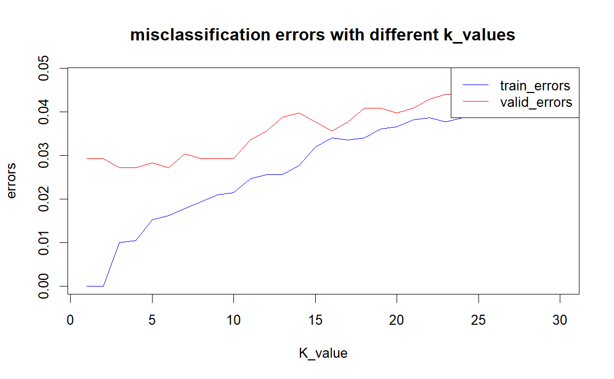
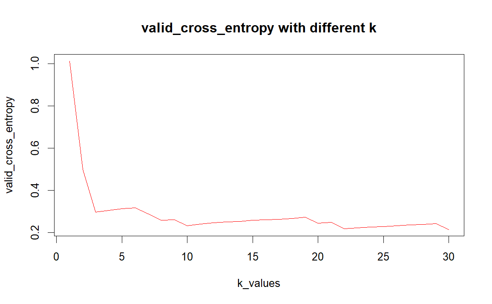

```{r setup, include=FALSE}
knitr::opts_chunk$set(echo = TRUE)
```

```{r include=FALSE}
library(kknn)
data <- read.csv("LAB1data/optdigits.csv", header = TRUE)  
data$X0.26 <- as.factor(data$X0.26)
n <- nrow(data)
set.seed(12345)
id <- sample(1:n,floor(n*0.5))
train <- data[id,]

valid_test <- data[-id,]
id_2 <- sample(1:nrow(valid_test),floor(nrow(valid_test)*0.5))
valid <- valid_test[id_2,]
test <- valid_test[-id_2,]

train_model <- kknn(X0.26~.,train,train,k=30,kernel = "rectangular")
train_predictions <- fitted(train_model)
test_model <- kknn(X0.26~.,train,test,k=30,kernel = "rectangular")
test_predictions <- fitted(test_model)

train_confusion_matrix <- table(Predicted = train_predictions, Actual = train$X0.26)
test_confusion_matrix <- table(Predicted = test_predictions, Actual = test$X0.26)

misclassification_train <- 1 - sum(diag(train_confusion_matrix)) / sum(train_confusion_matrix)

misclassification_test <- 1 - sum(diag(test_confusion_matrix)) / sum(test_confusion_matrix)


train_prob <- train_model$prob
index_eight <- which(train$X0.26 == "8")
prob_eight <- train_prob[index_eight, "8"]

ordered_indices <- order(prob_eight, decreasing = TRUE)
easiest_indices <- index_eight[ordered_indices[1:2]]

n <- length(ordered_indices)
hardest_indices <- index_eight[ordered_indices[(n-2):n]]


feature_columns <- setdiff(names(train), "X0.26")

easiest_features_1 <-  as.numeric(train[easiest_indices[1], feature_columns])
easiest_features_2 <-  as.numeric(train[easiest_indices[2], feature_columns])
hardest_features_1 <-  as.numeric(train[hardest_indices[1], feature_columns])
hardest_features_2 <-  as.numeric(train[hardest_indices[2], feature_columns])
hardest_features_3 <-  as.numeric(train[hardest_indices[3], feature_columns])

digit_matrix_easy_1 <- matrix(easiest_features_1, nrow = 8, ncol = 8, byrow = TRUE)
digit_matrix_easy_2 <- matrix(easiest_features_2, nrow = 8, ncol = 8, byrow = TRUE)
digit_matrix_hard_1 <- matrix(hardest_features_1, nrow = 8, ncol = 8, byrow = TRUE)
digit_matrix_hard_2 <- matrix(hardest_features_2, nrow = 8, ncol = 8, byrow = TRUE)
digit_matrix_hard_3 <- matrix(hardest_features_3, nrow = 8, ncol = 8, byrow = TRUE)

heatmap(digit_matrix_easy_1, Colv = NA, Rowv = NA, 
        main = paste("easiest_indices:",easiest_indices[1] ))
heatmap(digit_matrix_easy_2, Colv = NA, Rowv = NA, 
        main = paste("easiest_indices:",easiest_indices[2] ))
heatmap(digit_matrix_hard_1, Colv = NA, Rowv = NA, 
        main = paste("hardest_indices:",hardest_indices[1] ))
heatmap(digit_matrix_hard_2, Colv = NA, Rowv = NA, 
        main = paste("hardest_indices:",hardest_indices[2] ))
heatmap(digit_matrix_hard_3, Colv = NA, Rowv = NA, 
        main = paste("hardest_indices:",hardest_indices[3] ))

k_values <- c(1:30)
train_errors <- numeric(length(k_values))
valid_errors <- numeric(length(k_values))

for (i in k_values) {
  model <- kknn(X0.26 ~ ., train = train, test = train, k = i, kernel = "rectangular")
  pred_train <- fitted(model)
  train_cm <- table(Predicted = pred_train, Actual = train$X0.26)
  train_errors[i] <- 1 - sum(diag(train_cm)) / sum(train_cm)

  model_valid <- kknn(X0.26 ~ ., train = train, test = valid, k = i, kernel = "rectangular")
  pred_valid <- fitted(model_valid)
  valid_cm <- table(Predicted = pred_valid, Actual = valid$X0.26)
  valid_errors[i] <- 1 - sum(diag(valid_cm)) / sum(valid_cm)
}

plot(k_values, train_errors, type = "l", col = "blue", ylim = c(0, max(c(train_errors, valid_errors))),
     xlab = "K_value", ylab = "errors", main = "errors with different k_values")
lines(k_values, valid_errors, type = "l", col = "red")
legend("topright", legend = c("train_errors", "valid_errors"), col = c("blue", "red"), lty = 1)

optimal_K <- which.min(valid_errors)

final_model <- kknn(X0.26 ~ ., train = train, test = test, k = optimal_K, kernel = "rectangular")
pred_test <- fitted(final_model)
test_cm <- table(Predicted = pred_test, Actual = test$X0.26)
test_error <- 1 - sum(diag(test_cm)) / sum(test_cm)

valid_cross_entropy <- numeric(length(k_values))
class_levels <- levels(train$X0.26)
for (i in k_values) {
  model <- kknn(X0.26 ~ ., train = train, test = valid, k = i, kernel = "rectangular")
  prob_matrix <- model$prob
  
  epsilon <- 1e-15
  prob_matrix <- pmax(prob_matrix, epsilon)
  prob_matrix <- pmin(prob_matrix, 1 - epsilon)
  
  actual_classes <- as.numeric(valid$X0.26)
  
  N <- nrow(valid)
  cross_entropy <- 0
  for (j in 1:N) {
    class_index <- actual_classes[j]
    prob <- prob_matrix[j, class_index]
    cross_entropy <- cross_entropy - log(prob)
  }
  valid_cross_entropy[i] <- cross_entropy / N
}
plot(k_values, valid_cross_entropy, type = "l", col = "red",
     xlab = "k_values", ylab = "valid_cross_entropy", main = "valid_cross_entropy with different k")

min_value <- min(valid_cross_entropy)
threshold <- min_value * 1.3
first_stable_k <- which(valid_cross_entropy <= threshold)[1]

```

# Assignment 1

## Comment on the quality of predictions for different digits and on the overall prediction quality.

According to the test confusion matrix and misclassification rate (see Figure \@ref(fig:cm) and \@ref(fig:mr), the model performs best on number "0", but there is a high rate on number "5","8",and "9".

The overall misclassification rates of training data and test data are 0.04238619 and 0.05857741, which is acceptable.

Overall Performance: The model performs well with low misclassification rates and generalizes effectively across training and test sets.

## cases of digit “8”

Index 209 is the easiest one to be recognized. Index 1663 can barely make out the shape of eight.

## Fit a K-nearest neighbor classifiers with misclassification errors

```{r echo=FALSE}
cat("the optimal value of K is:",optimal_K,"\n" )
```

1.As the value of K increases, the model becomes less sensitive, i.e. the model complexity decreases. Smaller K values result in a more complex model (sensitive to noise), while larger K values make the model smoother (potentially resulting in underfitting).

2.The training error rate curve increases with the increase of K. With the increase of K, the validation error rate curve first decreases, reaches a lowest point (the best value k), and then may slightly increase or become stable.

### test error compared with training and valid error

```{r echo=FALSE}
cat("the test error is:", test_error,"\n")
cat("the training error is:", train_errors[3],"\n")
cat("the validation error is:", valid_errors[3],"\n")
```

The classification error rate of the model on training, verification and test sets is low, and the difference is not large, indicating that the model has consistent performance on different data sets.

## Fit K-nearest neighbor classifiers with cross-entropy

```{r echo=FALSE}
cat("the optimal value of K is:",first_stable_k,"\n" )
```

For multiple classification problems, cross entropy can reflect the degree of confidence of the model in predicting the correct category.

The misclassification rate only considers correct or incorrect classifications, but the cross-entropy is more sensitive to the probabilistic output of the model and therefore reflects the performance of the model in more detail. If a model misclassifies, but the probability of prediction is very close to the correct answer, the increase in cross entropy loss will be smaller than the misclassification rate, reflecting a more nuanced error situation.

```{r include=FALSE}
# data processing code for assignment 3
# I put code here, cause there would be conflicts about names of variables
# written by Trace

data = read.csv("LAB1data/pima-indians-diabetes.csv")
colnames(data) = list("pegnant_times", "glucose_level", "blood_pressure", "skin_thickness", "serum_insulin", "boby_mass", "diabetes_pedigree_func", "age", "diabetes")

model_data = as.data.frame(x = cbind(data$glucose_level, data$age, data$diabetes))
colnames(model_data) = list("x1", "x2", "label")
library(lattice)
library(caret)
model = train(as.factor(label) ~ ., 
              data = model_data, 
              method = "glm", 
              family = "binomial")
# summary(model)

output_prob = predict(model, model_data, type = "prob")[,2]
output_label  = ifelse(output_prob >= 0.5, 1, 0)

coeff = coef(model$finalModel)
intercept = coeff[1]
param_x1 = coeff[2]
param_x2 = coeff[3]


loss_model1  = mean((as.numeric(output_label) - as.numeric(model_data$label)) ** 2)
acc_model1 = mean(output_label == model_data$label)
```

# Assignment 3

## 3.1 Make a scatterplot showing a Plasma glucose concentration on Age where
observations are colored by Diabetes levels. Do you think that Diabetes is easy to classify by a standard logistic regression model that uses these two variables as features?  

The plot is here \@ref(fig:rd).
From the scatter plot between the given 2 features, that there is no any apparent boundary to classify the green points and red points representing whether being healthy or having diabetes. Based on that, I think it is not easy. 

## 3.2 
### 3.2.1 Report the probabilistic equation of the estimated model (i.e., how the target depends on the features and the estimated model parameters probabilistically).

The equation is: $$
P(y|X,\beta) = \sigma(X\beta) = \frac{1}{1+exp(-X\beta)}
$$ where $\sigma$() represents the sigmod function, $X$ is input data, $\beta$ is coefficients, and $y$ is predicted output.

### 3.2.2 Comment on the quality of the classification by using these results.

Based on accuracy of the prediction, besides the comparison between plots, it is obvious that the quality is not good enough to classify them well.
```{r echo=FALSE}
cat("The accuracy can be considered as quality of classification:", acc_model1,"\n")
cat("The misclassification error is:", loss_model1, "\n")
```

### 3.2.3 Make the scatter plot.

The plot is here \@ref(fig:po). 

## 3.3 
### 3.3.1 Use the model estimated in step 2 to a) report the equation of the decision boundary between the two classes b) add a curve showing this boundary to the scatter plot in step 2.

The plot with the curve is here \@ref(fig:db).
```{r echo=FALSE}
cat("Decision Boundary:", intercept, "+", param_x1, "* x1 +", param_x2, "* x2 = y bar")
```

### 3.3.2 Comment whether the decision boundary seems to catch the data distribution well.

The decision boundary is represented by a linear function, while the data distribution is more complicated than the data which can be caught by linear function. 

## 3.4 
### 3.4.1 Make same kind of plots as in step 2 but use thresholds 𝑟𝑟=0.2 and 𝑟𝑟=0.8. 
The plot with threhold = 0.2 is here \@ref(fig:th2), the plot with threhold = 0.8 is here \@ref(fig:th8).

## 3.4.2 By using these plots, comment on what happens with the prediction when r value changes. 
With the increasing value of r, less sample would be predicted as positive. 

## 3.5
```{r include=FALSE}
label = model_data$label
model_data$label = NULL

for (i in 0:4){
  feature_name = paste0("z", as.character(i+1))
  model_data[[feature_name]] = (model_data$x1 ** (4 - i)) * (model_data$x2 ** i)
}
model_data$label = label

model = train(as.factor(label) ~ ., 
              data = model_data, 
              method = "glm", 
              family = "binomial")
output_prob = predict(model, model_data, type = "prob")[,2]
output_label  = ifelse(output_prob >= 0.5, 1, 0)
loss_model2 = mean((as.numeric(output_label) - as.numeric(model_data$label)) ** 2)
acc_model2 = mean(output_label == model_data$label)
```
### 3.5.1 Create a scatterplot of the same kind as in step 2 for this model and compute the training misclassification rate.

The plot is here \@ref(fig:po2)
```{r echo=FALSE}
cat("The misclassification error of present model is:", loss_model2, "\n")
```
### 3.5.2 What can you say about the quality of this model compared to the previous logistic regression model?

After adding the non-linear elements into feature, the performance improved a little, but either cannot classify well.

```{r echo=FALSE}

cat("The misclassification error of present model is:", loss_model2, "\n")
cat("The misclassification error of previous model is:", loss_model1, "\n")
```
### 3.5.3 How have the basis expansion trick affected the shape of the decision boundary and the prediction accuracy?

The decision boundary generated from original features is a linear function, while the present decision boundary in the shape of exponential function plot. In the meanwhile, it does improve the accuracy but slightly.

```{r echo=FALSE}
cat("The accuracy of present model:", acc_model2, "\n")
cat("The accuracy of previous model: ", acc_model1, "\n")
```

# Appendix

## Code for assignment 1

```{r, echo=TRUE, eval=FALSE}
library(kknn)
data <- read.csv("LAB1data/optdigits.csv", header = TRUE)  
data$X0.26 <- as.factor(data$X0.26)
n <- nrow(data)
set.seed(12345)
id <- sample(1:n,floor(n*0.5))
train <- data[id,]

valid_test <- data[-id,]
id_2 <- sample(1:nrow(valid_test),floor(nrow(valid_test)*0.5))
valid <- valid_test[id_2,]
test <- valid_test[-id_2,]

train_model <- kknn(X0.26~.,train,train,k=30,kernel = "rectangular")
train_predictions <- fitted(train_model)
test_model <- kknn(X0.26~.,train,test,k=30,kernel = "rectangular")
test_predictions <- fitted(test_model)

train_confusion_matrix <- table(Predicted = train_predictions, Actual = train$X0.26)
test_confusion_matrix <- table(Predicted = test_predictions, Actual = test$X0.26)

misclassification_train <- 1 - sum(diag(train_confusion_matrix)) / sum(train_confusion_matrix)

misclassification_test <- 1 - sum(diag(test_confusion_matrix)) / sum(test_confusion_matrix)


train_prob <- train_model$prob
index_eight <- which(train$X0.26 == "8")
prob_eight <- train_prob[index_eight, "8"]

ordered_indices <- order(prob_eight, decreasing = TRUE)
easiest_indices <- index_eight[ordered_indices[1:2]]

n <- length(ordered_indices)
hardest_indices <- index_eight[ordered_indices[(n-2):n]]


feature_columns <- setdiff(names(train), "X0.26")

easiest_features_1 <-  as.numeric(train[easiest_indices[1], feature_columns])
easiest_features_2 <-  as.numeric(train[easiest_indices[2], feature_columns])
hardest_features_1 <-  as.numeric(train[hardest_indices[1], feature_columns])
hardest_features_2 <-  as.numeric(train[hardest_indices[2], feature_columns])
hardest_features_3 <-  as.numeric(train[hardest_indices[3], feature_columns])

digit_matrix_easy_1 <- matrix(easiest_features_1, nrow = 8, ncol = 8, byrow = TRUE)
digit_matrix_easy_2 <- matrix(easiest_features_2, nrow = 8, ncol = 8, byrow = TRUE)
digit_matrix_hard_1 <- matrix(hardest_features_1, nrow = 8, ncol = 8, byrow = TRUE)
digit_matrix_hard_2 <- matrix(hardest_features_2, nrow = 8, ncol = 8, byrow = TRUE)
digit_matrix_hard_3 <- matrix(hardest_features_3, nrow = 8, ncol = 8, byrow = TRUE)

heatmap(digit_matrix_easy_1, Colv = NA, Rowv = NA, 
        main = paste("easiest_indices:",easiest_indices[1] ))
heatmap(digit_matrix_easy_2, Colv = NA, Rowv = NA, 
        main = paste("easiest_indices:",easiest_indices[2] ))
heatmap(digit_matrix_hard_1, Colv = NA, Rowv = NA, 
        main = paste("hardest_indices:",hardest_indices[1] ))
heatmap(digit_matrix_hard_2, Colv = NA, Rowv = NA, 
        main = paste("hardest_indices:",hardest_indices[2] ))
heatmap(digit_matrix_hard_3, Colv = NA, Rowv = NA, 
        main = paste("hardest_indices:",hardest_indices[3] ))

k_values <- c(1:30)
train_errors <- numeric(length(k_values))
valid_errors <- numeric(length(k_values))

for (i in k_values) {
  model <- kknn(X0.26 ~ ., train = train, test = train, k = i, kernel = "rectangular")
  pred_train <- fitted(model)
  train_cm <- table(Predicted = pred_train, Actual = train$X0.26)
  train_errors[i] <- 1 - sum(diag(train_cm)) / sum(train_cm)

  model_valid <- kknn(X0.26 ~ ., train = train, test = valid, k = i, kernel = "rectangular")
  pred_valid <- fitted(model_valid)
  valid_cm <- table(Predicted = pred_valid, Actual = valid$X0.26)
  valid_errors[i] <- 1 - sum(diag(valid_cm)) / sum(valid_cm)
}

plot(k_values, train_errors, type = "l", col = "blue", ylim = c(0, max(c(train_errors, valid_errors))),
     xlab = "K_value", ylab = "errors", main = "errors with different k_values")
lines(k_values, valid_errors, type = "l", col = "red")
legend("topright", legend = c("train_errors", "valid_errors"), col = c("blue", "red"), lty = 1)

optimal_K <- which.min(valid_errors)

final_model <- kknn(X0.26 ~ ., train = train, test = test, k = optimal_K, kernel = "rectangular")
pred_test <- fitted(final_model)
test_cm <- table(Predicted = pred_test, Actual = test$X0.26)
test_error <- 1 - sum(diag(test_cm)) / sum(test_cm)

valid_cross_entropy <- numeric(length(k_values))
class_levels <- levels(train$X0.26)
for (i in k_values) {
  model <- kknn(X0.26 ~ ., train = train, test = valid, k = i, kernel = "rectangular")
  prob_matrix <- model$prob
  
  epsilon <- 1e-15
  prob_matrix <- pmax(prob_matrix, epsilon)
  prob_matrix <- pmin(prob_matrix, 1 - epsilon)
  
  actual_classes <- as.numeric(valid$X0.26)
  
  N <- nrow(valid)
  cross_entropy <- 0
  for (j in 1:N) {
    class_index <- actual_classes[j]
    prob <- prob_matrix[j, class_index]
    cross_entropy <- cross_entropy - log(prob)
  }
  valid_cross_entropy[i] <- cross_entropy / N
}
plot(k_values, valid_cross_entropy, type = "l", col = "red",
     xlab = "k_values", ylab = "valid_cross_entropy", main = "valid_cross_entropy with different k")

min_value <- min(valid_cross_entropy)
threshold <- min_value * 1.3
first_stable_k <- which(valid_cross_entropy <= threshold)[1]


```

## Code for assignment 3

```{r， echo=TRUE, eval=FALSE}
data = read.csv("LAB1data/pima-indians-diabetes.csv")
colnames(data) = list("pegnant_times", 
                      "glucose_level", 
                      "blood_pressure", 
                      "skin_thickness", 
                      "serum_insulin", 
                      "boby_mass", 
                      "diabetes_pedigree_func", 
                      "age", 
                      "diabetes")

library(lattice)
library(caret)
library(ggplot2)
# plot 1
ggplot(data, aes(age, glucose_level, color = as.factor(diabetes))) + 
  geom_point(size = 2) +
  labs(title = "Scatter Plot between Age and Glucose Level",
       x = "Age", 
       y = "Glucose Level") + 
  scale_color_manual(values = c("0" = "green", "1" = "red")) +
  theme_minimal()

# model 1
model_data = as.data.frame(x = cbind(data$glucose_level, data$age, data$diabetes))
colnames(model_data) = list("x1", "x2", "label")


model = train(as.factor(label) ~ ., 
              data = model_data, 
              method = "glm", 
              family = "binomial")

output_prob = predict(model, model_data, type = "prob")[,2]
output_label  = ifelse(output_prob >= 0.5, 1, 0)
loss_model1  = mean((as.numeric(output_label) - as.numeric(model_data$label)) ** 2)
cat("The misclassification error is:", loss_model1, "\n")
acc_model1 = mean(output_label == model_data$label)
cat("The accuracy can be considered as quality of classification:", acc_model1)

# plot 2
ggplot(cbind(model_data,output_label), aes(x2, x1, color = as.factor(output_label))) + 
  geom_point(size = 2) +
  labs(title = "Scatter Plot between Age and Glucose Level",
       x = "Age", 
       y = "Glucose Level") + 
  scale_color_manual(values = c("0" = "green", "1" = "red")) +
  theme_minimal()

coeff = coef(model$finalModel)
intercept = coeff[1]
param_x1 = coeff[2]
param_x2 = coeff[3]
cat("probabilistic equation:", intercept, "+", param_x1, "* x1 +", param_x2, "* x2 = y bar")


x2_range = seq(min(model_data$x2), max(model_data$x2), length.out = dim(model_data))
x1_bound = -(intercept + param_x2 * x2_range) / param_x1
# plot 3
ggplot(cbind(model_data,output_label), aes(x2, x1)) + 
  geom_point(aes(color = as.factor(output_label)),size = 2) +
  geom_line(aes(x = x2_range, y = x1_bound), color = "black", linetype = "dashed")+
  labs(title = "Scatter Plot between Age and Glucose Level",
       x = "Age", 
       y = "Glucose Level") + 
  scale_color_manual(values = c("0" = "green", "1" = "red")) +
  theme_minimal()

r = c(0.2, 0.8)
output_label  = ifelse(output_prob >= r[1], 1, 0)
# plot 4
ggplot(cbind(model_data,output_label), aes(x2, x1, color = as.factor(output_label))) + 
  geom_point(size = 2) +
  labs(title = "Scatter Plot between Age and Glucose Level",
       x = "Age", 
       y = "Glucose Level") + 
  scale_color_manual(values = c("0" = "green", "1" = "red")) +
  theme_minimal()

output_label  = ifelse(output_prob >= r[2], 1, 0)
ggplot(cbind(model_data,output_label), aes(x2, x1, color = as.factor(output_label))) + 
  geom_point(size = 2) +
  labs(title = "Scatter Plot between Age and Glucose Level",
       x = "Age", 
       y = "Glucose Level") + 
  scale_color_manual(values = c("0" = "green", "1" = "red")) +
  theme_minimal()

label = model_data$label
model_data$label = NULL

for (i in 0:4){
  feature_name = paste0("z", as.character(i+1))
  model_data[[feature_name]] = (model_data$x1 ** (4 - i)) * (model_data$x2 ** i)
}
model_data$label = label
head(model_data)
# model 2
model = train(as.factor(label) ~ ., 
              data = model_data, 
              method = "glm", 
              family = "binomial")
output_prob = predict(model, model_data, type = "prob")[,2]
output_label  = ifelse(output_prob >= 0.5, 1, 0)

loss_model2  = mean((as.numeric(output_label) - as.numeric(model_data$label)) ** 2)
acc_model2 = mean(output_label == model_data$label)
cat("The misclassification error is:", loss_model2, "\n")
cat("The accuracy can be considered as quality of classification:", acc_model2)

db_points = model_data[abs(output_prob - 0.5) < 0.05,]

# plot 5
ggplot() +
  geom_point(data = cbind(model_data, output_label), aes(x = x2, y = x1, color = as.factor(output_label))) +
  labs(title = "Scatter Plot between Age and Glucose Level",
       x = "Age", 
       y = "Glucose Level") + 
  scale_color_manual(values = c("0" = "green", "1" = "red")) +
  geom_smooth(data = db_points, aes(x = x2, y = x1), method = "loess",color = "black", linetype = "dashed") +
  theme_minimal()

```

## Figure for assignment 1

```{r echo=FALSE, fig.cap="A.1.1: Test Confusion Matrix",label="cm", out.width="80%"}
library(knitr)
include_graphics("./LAB1figure/cm.png")
```

```{r echo=FALSE, fig.cap="A.1.2: Misclassification Rate",label="mr", out.width="80%"}
include_graphics("./LAB1figure/rate.png")
```

```{r echo=FALSE, fig.cap="A.1.3: Heatmap of Digit 8\\_easiest", fig.show='hold', out.width="50%"}
include_graphics(c("./LAB1figure/map1.png", 
                   "./LAB1figure/map11.png"))
```

```{r echo=FALSE, fig.cap="A.1.4: Heatmap of Digit 8\\_hardest", fig.show='hold', out.width="33%"}
include_graphics(c("./LAB1figure/map2.png", 
                   "./LAB1figure/map22.png",
                   "./LAB1figure/map23.png"))
```

```{r echo=FALSE, fig.cap="A.1.5: Misclassification Error", out.width="80%"}

```

```{r echo=FALSE, fig.cap="A.1.6: Validation Cross Entropy", out.width="80%"}

```

## Figures for assignment 3

```{r echo=FALSE, fig.cap="A.3.1: Raw Data Distribution", out.width="80%", label="rd"}
library(knitr)
include_graphics("./LAB1figure/3.1.png")
```

```{r echo=FALSE, fig.cap="A.3.2: Prediction Outcome", out.width="80%", label="po"}
include_graphics("./LAB1figure/3.2.png")
```

```{r echo=FALSE, fig.cap="A.3.3: Prediction Outcome with Decision Boundary", out.width="80%", label="db"}
include_graphics("./LAB1figure/3.3.png")
```

```{r echo=FALSE, fig.cap="A.3.4.1: Prediction Outcome with Threhold = 0.2", out.width="80%", label="th2"}
include_graphics("./LAB1figure/3.4.1.png")
```

```{r echo=FALSE, fig.cap="A.3.4.2: Prediction Outcome with Threhold = 0.8", out.width="80%", label="th8"}
include_graphics("./LAB1figure/3.4.2.png")
```

```{r echo=FALSE, fig.cap="A.3.5: Prediction Outcome based Computed Features with Decision Boundary", out.width="80%", label="po2"}
include_graphics("./LAB1figure/3.5.png")
```
