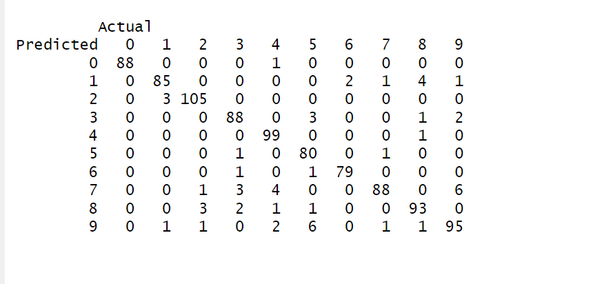
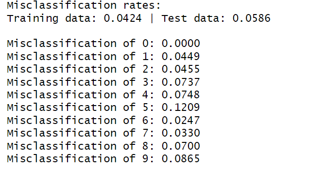
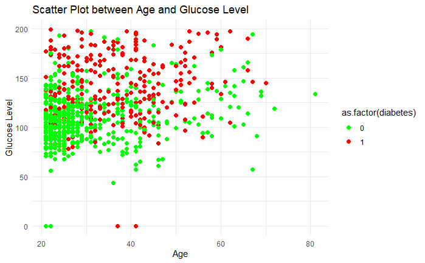
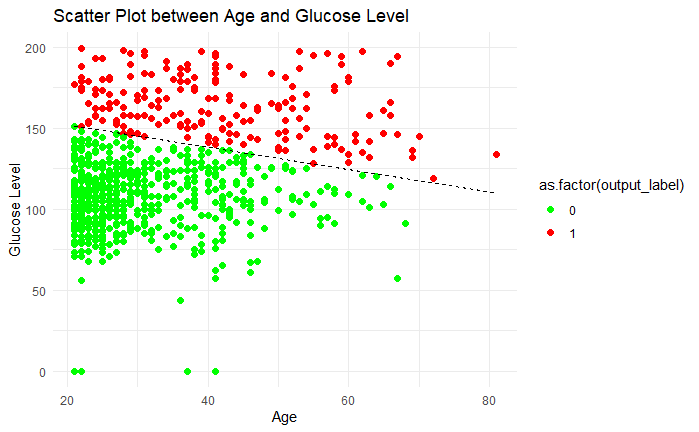
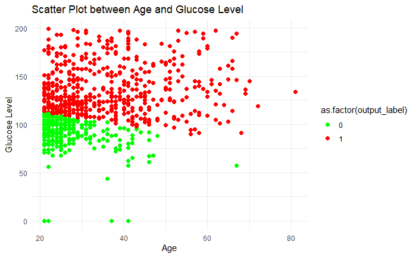
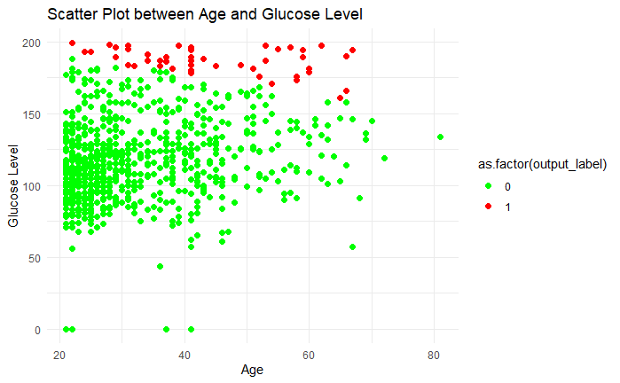
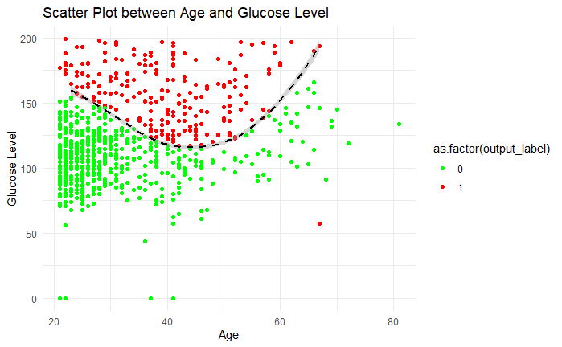

```{r setup, include=FALSE}
knitr::opts_chunk$set(echo = TRUE)
```

```{r include=FALSE}
library(kknn)
library(gridExtra)
library(grid)
library(png)

data <- read.csv("LAB1data/optdigits.csv", header = TRUE)  
data$X0.26 <- as.factor(data$X0.26)
n <- nrow(data)
set.seed(12345)
id <- sample(1:n,floor(n*0.5))
train <- data[id,]

valid_test <- data[-id,]
id_2 <- sample(1:nrow(valid_test),floor(nrow(valid_test)*0.5))
valid <- valid_test[id_2,]
test <- valid_test[-id_2,]

train_model <- kknn(X0.26~.,train,train,k=30,kernel = "rectangular")
train_predictions <- fitted(train_model)
test_model <- kknn(X0.26~.,train,test,k=30,kernel = "rectangular")
test_predictions <- fitted(test_model)

train_confusion_matrix <- table(Predicted = train_predictions, Actual = train$X0.26)
test_confusion_matrix <- table(Predicted = test_predictions, Actual = test$X0.26)

misclassification_train <- 1 - sum(diag(train_confusion_matrix)) / sum(train_confusion_matrix)

misclassification_test <- 1 - sum(diag(test_confusion_matrix)) / sum(test_confusion_matrix)


train_prob <- train_model$prob
index_eight <- which(train$X0.26 == "8")
prob_eight <- train_prob[index_eight, "8"]

ordered_indices <- order(prob_eight, decreasing = TRUE)
easiest_indices <- index_eight[ordered_indices[1:2]]

n <- length(ordered_indices)
hardest_indices <- index_eight[ordered_indices[(n-2):n]]


feature_columns <- setdiff(names(train), "X0.26")

easiest_features_1 <-  as.numeric(train[easiest_indices[1], feature_columns])
easiest_features_2 <-  as.numeric(train[easiest_indices[2], feature_columns])
hardest_features_1 <-  as.numeric(train[hardest_indices[1], feature_columns])
hardest_features_2 <-  as.numeric(train[hardest_indices[2], feature_columns])
hardest_features_3 <-  as.numeric(train[hardest_indices[3], feature_columns])

digit_matrix_easy_1 <- matrix(easiest_features_1, nrow = 8, ncol = 8, byrow = TRUE)
digit_matrix_easy_2 <- matrix(easiest_features_2, nrow = 8, ncol = 8, byrow = TRUE)
digit_matrix_hard_1 <- matrix(hardest_features_1, nrow = 8, ncol = 8, byrow = TRUE)
digit_matrix_hard_2 <- matrix(hardest_features_2, nrow = 8, ncol = 8, byrow = TRUE)
digit_matrix_hard_3 <- matrix(hardest_features_3, nrow = 8, ncol = 8, byrow = TRUE)

heatmap(digit_matrix_easy_1, Colv = NA, Rowv = NA, 
        main = paste("easiest_indices:",easiest_indices[1] ))
heatmap(digit_matrix_easy_2, Colv = NA, Rowv = NA, 
        main = paste("easiest_indices:",easiest_indices[2] ))
heatmap(digit_matrix_hard_1, Colv = NA, Rowv = NA, 
        main = paste("hardest_indices:",hardest_indices[1] ))
heatmap(digit_matrix_hard_2, Colv = NA, Rowv = NA, 
        main = paste("hardest_indices:",hardest_indices[2] ))
heatmap(digit_matrix_hard_3, Colv = NA, Rowv = NA, 
        main = paste("hardest_indices:",hardest_indices[3] ))

k_values <- c(1:30)
train_errors <- numeric(length(k_values))
valid_errors <- numeric(length(k_values))

for (i in k_values) {
  model <- kknn(X0.26 ~ ., train = train, test = train, k = i, kernel = "rectangular")
  pred_train <- fitted(model)
  train_cm <- table(Predicted = pred_train, Actual = train$X0.26)
  train_errors[i] <- 1 - sum(diag(train_cm)) / sum(train_cm)

  model_valid <- kknn(X0.26 ~ ., train = train, test = valid, k = i, kernel = "rectangular")
  pred_valid <- fitted(model_valid)
  valid_cm <- table(Predicted = pred_valid, Actual = valid$X0.26)
  valid_errors[i] <- 1 - sum(diag(valid_cm)) / sum(valid_cm)
}

plot(k_values, train_errors, type = "l", col = "blue", ylim = c(0, max(c(train_errors, valid_errors))),
     xlab = "K_value", ylab = "errors", main = "errors with different k_values")
lines(k_values, valid_errors, type = "l", col = "red")
legend("topright", legend = c("train_errors", "valid_errors"), col = c("blue", "red"), lty = 1)

optimal_K <- which.min(valid_errors)

final_model <- kknn(X0.26 ~ ., train = train, test = test, k = optimal_K, kernel = "rectangular")
pred_test <- fitted(final_model)
test_cm <- table(Predicted = pred_test, Actual = test$X0.26)
test_error <- 1 - sum(diag(test_cm)) / sum(test_cm)

valid_cross_entropy <- numeric(length(k_values))
class_levels <- levels(train$X0.26)
for (i in k_values) {
  model <- kknn(X0.26 ~ ., train = train, test = valid, k = i, kernel = "rectangular")
  prob_matrix <- model$prob
  
  epsilon <- 1e-15
  prob_matrix <- pmax(prob_matrix, epsilon)
  prob_matrix <- pmin(prob_matrix, 1 - epsilon)
  
  actual_classes <- as.numeric(valid$X0.26)
  
  N <- nrow(valid)
  cross_entropy <- 0
  for (j in 1:N) {
    class_index <- actual_classes[j]
    prob <- prob_matrix[j, class_index]
    cross_entropy <- cross_entropy - log(prob)
  }
  valid_cross_entropy[i] <- cross_entropy / N
}
plot(k_values, valid_cross_entropy, type = "l", col = "red",
     xlab = "k_values", ylab = "valid_cross_entropy", main = "valid_cross_entropy with different k")

min_value <- min(valid_cross_entropy)
threshold <- min_value * 1.3
first_stable_k <- which(valid_cross_entropy <= threshold)[1]

```
\clearpage
# Statement of Contribution

The contributions are distributed as follows:

Yanjie Lyu: Worked on Assignment 1 and Question 1 from Assignment 4.

Yi Yang: Worked on Assignment 2 and Question 3 from Assignment 4.

Qingxuan Cui: Worked on Assignment 3 and Question 2 from Assignment 4.

After completing their respective assignments (including code writing
and analysis), all results were shared and thoroughly discussed among
the three members. the group report was created based on this
discussion.

# Assignment 1

## Comment on the quality of predictions for different digits and on the overall prediction quality

According to the test confusion matrix and misclassification rate (see
Figure \@ref(fig:cm) and \@ref(fig:mr)), the model performs best on
number "0", but there is a high rate on number "5","8",and "9".

The overall misclassification rates of training data and test data are
0.04238619 and 0.05857741, which is acceptable.

Overall Performance: The model performs well with low misclassification
rates and generalizes effectively across training and test sets.

## cases of digit “8”

Accroding to Figure \@ref(fig:easy), index 209 is the easiest one to be
recognized, and in Figure \@ref(fig:hard), index 1663 can barely make
out the shape of eight.

## Fit a K-nearest neighbor classifiers with misclassification errors

```{r echo=FALSE}
cat("the optimal value of K is:",optimal_K,"\n" )
```

\begin{figure}[h]
  \begin{minipage}{0.4\textwidth}
    1.As the value of K increases, the model becomes less sensitive, i.e. the model complexity decreases. Smaller K values result in a more complex model (sensitive to noise), while larger K values make the model smoother (potentially resulting in underfitting).

2.The training error rate curve increases with the increase of K. With the increase of K, the validation error rate curve first decreases, reaches a lowest point (the best value k), and then may slightly increase or become stable.
  \end{minipage}
  \hfill
  \begin{minipage}{0.5\textwidth}
    \includegraphics[width=\textwidth]{./LAB1figure/000014.png}
  \end{minipage}
  \caption{A.1.1: Misclassification Error}
\end{figure}

### test error compared with training and valid error

```{r echo=FALSE}
cat("the test error is:", test_error,"\n")
cat("the training error is:", train_errors[3],"\n")
cat("the validation error is:", valid_errors[3],"\n")
```

The classification error rate of the model on training, verification and
test sets is low, and the difference is not large, indicating that the
model has consistent performance on different data sets.

## Fit K-nearest neighbor classifiers with cross-entropy

```{r echo=FALSE}
cat("the optimal value of K is:",first_stable_k,"\n" )
```

\begin{figure}[h]
  \begin{minipage}{0.4\textwidth}
    1.For multiple classification problems, cross entropy can reflect the degree of confidence of the model in predicting the correct category.

2.The misclassification rate only considers correct or incorrect classifications, but the cross-entropy is more sensitive to the probabilistic output of the model and therefore reflects the performance of the model in more detail. If a model misclassifies, but the probability of prediction is very close to the correct answer, the increase in cross entropy loss will be smaller than the misclassification rate, reflecting a more nuanced error situation.
  \end{minipage}
  \hfill
  \begin{minipage}{0.5\textwidth}
    \includegraphics[width=\textwidth]{./LAB1figure/000010.png}
  \end{minipage}
  \caption{A.1.2: Validation Cross Entropy}
\end{figure}

```{r include=FALSE}
data = read.csv("LAB1data/pima-indians-diabetes.csv")
colnames(data) = list("pegnant_times", 
                      "glucose_level", 
                      "blood_pressure", 
                      "skin_thickness", 
                      "serum_insulin", 
                      "boby_mass", 
                      "diabetes_pedigree_func", 
                      "age", 
                      "diabetes")

library(lattice)
library(caret)
library(ggplot2)
# plot 1
ggplot(data, aes(age, glucose_level, color = as.factor(diabetes))) + 
  geom_point(size = 2) +
  labs(title = "Scatter Plot between Age and Glucose Level",
       x = "Age", 
       y = "Glucose Level") + 
  scale_color_manual(values = c("0" = "green", "1" = "red")) +
  theme_minimal()

# model 1
model_data = as.data.frame(x = cbind(data$glucose_level, data$age, data$diabetes))
colnames(model_data) = list("x1", "x2", "label")


model = train(as.factor(label) ~ ., 
              data = model_data, 
              method = "glm", 
              family = "binomial")

output_prob = predict(model, model_data, type = "prob")[,2]
output_label  = ifelse(output_prob >= 0.5, 1, 0)
loss_model1  = mean((as.numeric(output_label) - as.numeric(model_data$label)) ** 2)
cat("The misclassification error is:", loss_model1,"\n")
acc_model1 = mean(output_label == model_data$label)
cat("The accuracy can be considered as quality of classification:", acc_model1)

# plot 2
ggplot(cbind(model_data,output_label), aes(x2, x1, color = as.factor(output_label))) + 
  geom_point(size = 2) +
  labs(title = "Scatter Plot between Age and Glucose Level",
       x = "Age", 
       y = "Glucose Level") + 
  scale_color_manual(values = c("0" = "green", "1" = "red")) +
  theme_minimal()

coeff = coef(model$finalModel)
intercept = coeff[1]
param_x1 = coeff[2]
param_x2 = coeff[3]
cat("probabilistic equation:", intercept, "+", param_x1, "* x1 +", param_x2, "* x2 = y bar")


x2_range = seq(min(model_data$x2), max(model_data$x2), length.out = dim(model_data))
x1_bound = -(intercept + param_x2 * x2_range) / param_x1
# plot 3
ggplot(cbind(model_data,output_label), aes(x2, x1)) + 
  geom_point(aes(color = as.factor(output_label)),size = 2) +
  geom_line(aes(x = x2_range, y = x1_bound), color = "black", linetype = "dashed")+
  labs(title = "Scatter Plot between Age and Glucose Level",
       x = "Age", 
       y = "Glucose Level") + 
  scale_color_manual(values = c("0" = "green", "1" = "red")) +
  theme_minimal()

r = c(0.2, 0.8)
output_label  = ifelse(output_prob >= r[1], 1, 0)
# plot 4
ggplot(cbind(model_data,output_label), aes(x2, x1, color = as.factor(output_label))) + 
  geom_point(size = 2) +
  labs(title = "Scatter Plot between Age and Glucose Level",
       x = "Age", 
       y = "Glucose Level") + 
  scale_color_manual(values = c("0" = "green", "1" = "red")) +
  theme_minimal()

output_label  = ifelse(output_prob >= r[2], 1, 0)
ggplot(cbind(model_data,output_label), aes(x2, x1, color = as.factor(output_label))) + 
  geom_point(size = 2) +
  labs(title = "Scatter Plot between Age and Glucose Level",
       x = "Age", 
       y = "Glucose Level") + 
  scale_color_manual(values = c("0" = "green", "1" = "red")) +
  theme_minimal()

label = model_data$label
model_data$label = NULL

for (i in 0:4){
  feature_name = paste0("z", as.character(i+1))
  model_data[[feature_name]] = (model_data$x1 ** (4 - i)) * (model_data$x2 ** i)
}
model_data$label = label
head(model_data)
# model 2
model = train(as.factor(label) ~ ., 
              data = model_data, 
              method = "glm", 
              family = "binomial")
output_prob = predict(model, model_data, type = "prob")[,2]
output_label  = ifelse(output_prob >= 0.5, 1, 0)

loss_model2  = mean((as.numeric(output_label) - as.numeric(model_data$label)) ** 2)
acc_model2 = mean(output_label == model_data$label)
cat("The misclassification error is:", loss_model2, "\n")
cat("The accuracy can be considered as quality of classification:", acc_model2)

db_points = model_data[abs(output_prob - 0.5) < 0.05,]

# plot 5
ggplot() +
  geom_point(data = cbind(model_data, output_label), aes(x = x2, y = x1, color = as.factor(output_label))) +
  labs(title = "Scatter Plot between Age and Glucose Level",
       x = "Age", 
       y = "Glucose Level") + 
  scale_color_manual(values = c("0" = "green", "1" = "red")) +
  geom_smooth(data = db_points, aes(x = x2, y = x1), method = "loess",color = "black", linetype = "dashed") +
  theme_minimal()
```

# Assignment 2

```{r include=FALSE}
parkinsons <- read.csv("LAB1data/parkinsons.csv",header=TRUE)

parkinsons <- parkinsons[,!names(parkinsons)%in%c("subject.","age","sex","test_time","total_UPDRS")]

library(caret)
#data scaling
set.seed(12345)
n <- nrow(parkinsons)
id <- sample(1:n,floor(n*0.6))
train <- parkinsons[id,]
test <- parkinsons[-id,]

scaler <- preProcess(train)    
trainS <- predict(scaler,train)
testS <- predict(scaler,test)

#fit the model 
fit <- lm(motor_UPDRS~.-1,data=trainS)
summary(fit)

#using model to predict training and test data

predictions_train <- predict(fit,newdata=trainS)

predictions_test <- predict(fit, newdata = testS)

#compute MSE for trainning and test data
MSE_trainning <- mean((trainS$motor_UPDRS-predictions_train)^2)
MSE_test <- mean((testS$motor_UPDRS-predictions_test)^2)
cat("MSE for the training data is :",MSE_trainning,"\n")
cat("MSE for the test data is :",MSE_test,"\n")


#The coefficient`Jitter.Abs.`,`Shimmer.APQ5`,`Shimmer.APQ11`,`NHR`,`HNR`,`DFA`,`PPE`
#is highly significant, as their P-value < 0.001,which suggests that they have a strong 
#and statistically reliable impact on the response variable.

#The coefficient for `Shimmer.dB.` is statistically significant, as its P-value < 0.01. 
#This suggests that `Shimmer.dB.` has a meaningful and reliable impact on the response variable.


#log_likelihood
Loglikelihood <- function(theta,sigma,X,Y){
  n <- length(Y)
  predicted_Y <- X%*%theta
  squared_error <- (Y-predicted_Y)^2
  log_likelihood <- -0.5*n*log(2*pi*sigma^2)-0.5/sigma^2*sum(squared_error)
  return(log_likelihood)
}

#compute the loglikelihood for the fitting model

 #extract theta
theta <- coef(fit)


 #extract sigma
residual_train <- trainS$motor_UPDRS-predictions_train
sigma <- sqrt(mean(residual_train^2)) 

 #extract X as feature matrix for the training data
X_train <- as.matrix(trainS[,-1])
 #extract Y
Y_train <- as.numeric(trainS$motor_UPDRS)

 #compute loglikelihood for the training data
Loglikelihood(theta,sigma,X_train,Y_train)

#Ridge 
Ridge <- function(theta,sigma,lambda,X,Y){
  penalty <- lambda*sum(theta^2) #penalty 
  loglikelihood <- Loglikelihood(theta,sigma,X,Y)
  ridge_loglikelihood <- -loglikelihood+penalty 
  return(ridge_loglikelihood)
}

#RidgeOpt

RidgeOpt <- function(lambda,X,Y){
  
  #object function
  objfun <- function(params){
    #extract theta and sigma
    theta <- params[1:ncol(X)]
    sigma <- params[ncol(X)+1]
    #ensure sigma is non-negative
    if(sigma<=0)
      return(Inf)
    
    #compute ridge-loglikelihood
    RidgeLikelihood <- Ridge(theta,sigma,lambda,X,Y)
    return(RidgeLikelihood) 
  }
  #initialize theta and sigma
  initialized_theta <- rep(0,ncol(X)) #theta to be 0
  initialized_sigma <- sd(Y)    
  
  #combine theta with sigma
  initialized_params <- c(initialized_theta,initialized_sigma)
  
  #using optim function to optimize
  result <- optim(par=initialized_params,
                  fn=objfun,
                  method = "BFGS",
                  control = list(maxit=1000))
   if(result$convergence!=0){
     warning("Optimization did not converge.")
   }                
  optimezed_params <- result$par
  return(list(theta=optimezed_params[1:ncol(X)],
              sigma=optimezed_params[ncol(X)+1],
              value=-result$value, 
              convergence=result$convergence)) 
  
}

#degree of freedom

DF <- function(lambda,X){
  XtX <- t(X)%*%X                              #t(X)*x
  XtX_lambda <- XtX+lambda*diag(ncol(X))       #t(X)*x+lambda*I
  Hat_matrix <- X%*%solve(XtX_lambda)%*%t(X)
  df <- sum(diag(Hat_matrix))                           #trace of the hat matrix
  return(df)
}

X_test <- as.matrix(testS[,-1])
Y_test <- as.numeric(testS$motor_UPDRS)

#result and predicted values for training and testing data  and MSE value
#lambda=1
result1 <- RidgeOpt(1, X_train, Y_train)
theta1 <- result1$theta
sigma <- result1$sigma
predicted_1_Y_train <- X_train%*%theta1
predicted_1_Y_test <- X_test%*%theta1
MSE_1_trian <- mean((Y_train-predicted_1_Y_train)^2)
MSE_1_test <- mean((Y_test-predicted_1_Y_test)^2)
df_1 <- DF(1,X_train)
cat("Training data MSE when lambda=1:",MSE_1_trian,"\n")
cat("Test data MSE when lambda=1:",MSE_1_test,"\n")
cat("Degree of freedom when lambda=1:",df_1,"\n")


#lambda=100
result2 <- RidgeOpt(100, X_train, Y_train)
theta2 <- result2$theta
sigma2 <- result2$sigma
predicted_100_Y_train <- X_train%*%theta2
predicted_100_Y_test <- X_test%*%theta2
MSE_100_trian <- mean((Y_train-predicted_100_Y_train)^2)
MSE_100_test <- mean((Y_test-predicted_100_Y_test)^2)
df_100 <- DF(100,X_train)
cat("Training data MSE when lambda=100:",MSE_100_trian,"\n")
cat("Test data MSE when lambda=100:",MSE_100_test,"\n")
cat("Degree of freedom when lambda=100:",df_100,"\n")

#lambda=1000
result3 <- RidgeOpt(1000, X_train, Y_train)
theta3 <- result3$theta
sigma3 <- result3$sigma
predicted_1000_Y_train <- X_train%*%theta3
predicted_1000_Y_test <- X_test%*%theta3
MSE_1000_trian <- mean((Y_train-predicted_1000_Y_train)^2)
MSE_1000_test <- mean((Y_test-predicted_1000_Y_test)^2)
df_1000 <- DF(1000,X_train)
cat("Training data MSE when lambda=1000:",MSE_1000_trian,"\n")
cat("Test data MSE when lambda=1000:",MSE_1000_test,"\n")
cat("Degree of freedom when lambda=1000:",df_1000,"\n")
```

## Compute a linear regression from the training data

\begin{figure}[H]
  \begin{minipage}{0.4\textwidth}
    Using `lm()`to fit a linear regression model without intercept, we got the summary of the model as follows:
  \end{minipage}
  \hfill
  \begin{minipage}{0.5\textwidth}
    \includegraphics[width=0.8\textwidth]{./LAB1figure/sum.png}
  \end{minipage}
  \caption{A.2.1: Summary}
\end{figure}

## Estimate traing and test MSE

The MSE for training and test data show as follows:

```{r echo=FALSE}
cat("MSE for the training data is :",MSE_trainning,"\n")
cat("MSE for the test data is :",MSE_test,"\n")
```

## Commenting on Significant Variable Contributions to the Model

The
coefficient`Jitter.Abs.`,`Shimmer.APQ5`,`Shimmer.APQ11`,`NHR`,`HNR`,`DFA`,`PPE`
is highly significant, as their P-value are less than 0.001,which
suggests that they have a strong and statistically reliable impact on
the response variable. The coefficient `Shimmer` is statistically
significant,with a P-value \< 0.01,indicating that `Shimmer` has a
meaningful and reliable impact on the response variable.

## Using `RidgeOpt`to compute optimal parameters when lambda=1, 100 and 1000

The training and test MSE for different lambda and the degrees of
freedom shows as follws:

```{r echo=FALSE}
result1 <- RidgeOpt(1, X_train, Y_train)
theta1 <- result1$theta
sigma <- result1$sigma
predicted_1_Y_train <- X_train%*%theta1
predicted_1_Y_test <- X_test%*%theta1
MSE_1_trian <- mean((Y_train-predicted_1_Y_train)^2)
MSE_1_test <- mean((Y_test-predicted_1_Y_test)^2)
df_1 <- DF(1,X_train)
cat("Training data MSE when lambda = 1 :",MSE_1_trian,"\n")
cat("Test data MSE when lambda =1 :",MSE_1_test,"\n")
cat("Degree of freedom when lambda = 1:",df_1,"\n")
cat("\n")

#lambda=100
result2 <- RidgeOpt(100, X_train, Y_train)
theta2 <- result2$theta
sigma2 <- result2$sigma
predicted_100_Y_train <- X_train%*%theta2
predicted_100_Y_test <- X_test%*%theta2
MSE_100_trian <- mean((Y_train-predicted_100_Y_train)^2)
MSE_100_test <- mean((Y_test-predicted_100_Y_test)^2)
df_100 <- DF(100,X_train)
cat("Training data MSE when lambda = 100 :",MSE_100_trian,"\n")
cat("Test data MSE when lambda = 100 :",MSE_100_test,"\n")
cat("Degree of freedom when lambda = 100 :",df_100,"\n")
cat("\n")

#lambda=1000
result3 <- RidgeOpt(1000, X_train, Y_train)
theta3 <- result3$theta
sigma3 <- result3$sigma
predicted_1000_Y_train <- X_train%*%theta3
predicted_1000_Y_test <- X_test%*%theta3
MSE_1000_trian <- mean((Y_train-predicted_1000_Y_train)^2)
MSE_1000_test <- mean((Y_test-predicted_1000_Y_test)^2)
df_1000 <- DF(1000,X_train)
cat("Training data MSE when lambda = 1000 :",MSE_1000_trian,"\n")
cat("Test data MSE when lambda = 1000 :",MSE_1000_test,"\n")
cat("Degree of freedom when lambda = 1000 :",df_1000,"\n")
cat("\n")
```

## Comenting on which is the most appropriate penalty parameter

Among the selected penalty parameters, lambda = 100 is the most
appropriate .It provides the lowest test data MSE(0.9323316). Besides,
the degree of freedom for lambda = 100 is 9.924887, which shows a
balanced model complexity that avoids both overfitting and underfitting.

# Assignment 3

## Step1

### Make a scatterplot showing a Plasma glucose concentration on Age where observations are colored by Diabetes levels

The plot is shown in Figure \@ref(fig:rd).

### Debate whether Diabetes is easy to classify by a standard logistic regression model

From the scatter plot between the given 2 features, that there is no any
apparent boundary to classify the green points and red points
representing whether being healthy or having diabetes. Based on that, I
think it is not easy.

## Step2

### Report the probabilistic equation of the estimated model

The equation is: $$
P(y|X,\beta) = \sigma(X\beta) = \frac{1}{1+exp(-X\beta)}
$$ where: $\sigma$() represents the sigmod function

$X$ is input data

$\beta$ is coefficients

$y$ is predicted output

### Comment on the quality of the classification by using these results

Based on accuracy of the prediction, besides the comparison between
plots, it is obvious that the quality is not good enough to classify
them well.

```{r echo=FALSE}
result_1 <- paste("The accuracy can be considered as quality of classification:", acc_model1)
print(result_1)
result_2 <- paste("Misclassification error is:", loss_model1)
print(result_2)
```

### Make the scatter plot

The plot is shown in Figure \@ref(fig:po).

## Step3

### Use the model estimated in step 2 to report the equation of the decision boundary between the two classes

```{r echo=FALSE}
cat("Decision Boundary:", intercept, "+", param_x1, "* x1 +", param_x2, "* x2 = y bar")
```

### Add a curve showing this boundary to the scatter plot in step 2

The plot with the curve is shown in Figure \@ref(fig:db).

### Comment whether the decision boundary seems to catch the data distribution well

The decision boundary is represented by a linear function, while the
data distribution is more complicated than the data which can be caught
by linear function.

## Step4

### Make same kind of plots as in step 2 but use thresholds r=0.2 and r=0.8

The plot with threhold = 0.2 and threhold = 0.8 are shown in Figure
\@ref(fig:th2) and Figure \@ref(fig:th8), repectively.

### By using these plots, comment on what happens with the prediction when r value changes

With the increasing value of r, less sample would be predicted as
positive.

```{r eval=FALSE, include=FALSE}
label = model_data$label
model_data$label = NULL

for (i in 0:4){
  feature_name = paste0("z", as.character(i+1))
  model_data[[feature_name]] = (model_data$x1 ** (4 - i)) * (model_data$x2 ** i)
}
model_data$label = label

model = train(as.factor(label) ~ ., 
              data = model_data, 
              method = "glm", 
              family = "binomial")
output_prob = predict(model, model_data, type = "prob")[,2]
output_label  = ifelse(output_prob >= 0.5, 1, 0)
loss_model2 = mean((as.numeric(output_label) - as.numeric(model_data$label)) ** 2)
acc_model2 = mean(output_label == model_data$label)
```

## Step5

### Create a scatterplot of the same kind as in step 2 for this model and compute the training misclassification rate

The plot is shown in Figure \@ref(fig:po2)

```{r echo=FALSE}
cat("The misclassification error of the present model is:", loss_model2, "\n")
```

### What can you say about the quality of this model compared to the previous logistic regression model

After adding the non-linear elements into features, the performance of
the model improved a little, but either cannot classify well.

```{r echo=FALSE}

cat("The misclassification error of the present model is:", loss_model2, "\n")
cat("The misclassification error of the previous model is:", loss_model1, "\n")
```

### How have the basis expansion trick affected the shape of the decision boundary and the prediction accuracy

The decision boundary generated from original features is a linear
function, while the present decision boundary in the shape ofexponential
function plot. In the meanwhile, it does improve the accuracy but
slightly.

```{r echo=FALSE}
cat("The accuracy of the present model:", acc_model2, "\n")
cat("The accuracy of the previous model: ", acc_model1, "\n")
```

# Assignment 4. Theory

## Importance to consider various probability thresholds in classification problems.

In classification problems, r=0.5 may not always the most important
aspect of classifier. Many classification problems are asymmetric or
imbalanced. For example, it can be important not to falsely predict the
negative class than to falsely to predict the positive class in a
medical diagnosis application.Besides, the medical problem could be
imbalanced if the disorder is very rare. Adjusting the threshold r is
essential to achieve performance based on different context(page 47-48).

## Methods of collecting correct values of the labels for the supervised learning problems.

The vaules of label can be:

manually assigned by domain experts or possiblysome auxiliary
examination

calculated via specialised experiments and theories

obtained from the historical records(page 4-6)

## Express the cost fucntion of the linear regression in the matrix form.

The cost function for the linear regression in the matrix form is
defined as: $$
J(\theta) = \frac{1}{n} \sum_{i=1}^{n} \left( \hat{y}(x_i; \theta) - y_i \right)^2
= \frac{1}{n} \| \hat{y} - y \|_2^2
= \frac{1}{n} \| X \theta - y \|_2^2
= \frac{1}{n} \| \epsilon \|_2^2
$$ where: $\hat{y} = X \theta$ is the vector of the predicted values

$y$ is the vector of true values

$\epsilon = y - \hat{y}$ is the residuals

$\|\cdot \|$ denotes the Euclidean norm

This cost function is also referred to as the least squares cost. (page
40,formula(3.11))

# Appendix

## Code for assignment 1

```{r, echo=TRUE, eval=FALSE}
library(kknn)
data <- read.csv("LAB1data/optdigits.csv", header = TRUE)  
data$X0.26 <- as.factor(data$X0.26)
n <- nrow(data)
set.seed(12345)
id <- sample(1:n,floor(n*0.5))
train <- data[id,]

valid_test <- data[-id,]
id_2 <- sample(1:nrow(valid_test),floor(nrow(valid_test)*0.5))
valid <- valid_test[id_2,]
test <- valid_test[-id_2,]

train_model <- kknn(X0.26~.,train,train,k=30,kernel = "rectangular")
train_predictions <- fitted(train_model)
test_model <- kknn(X0.26~.,train,test,k=30,kernel = "rectangular")
test_predictions <- fitted(test_model)

train_confusion_matrix <- table(Predicted = train_predictions, Actual = train$X0.26)
test_confusion_matrix <- table(Predicted = test_predictions, Actual = test$X0.26)

misclassification_train <- 1 - sum(diag(train_confusion_matrix)) / sum(train_confusion_matrix)

misclassification_test <- 1 - sum(diag(test_confusion_matrix)) / sum(test_confusion_matrix)


train_prob <- train_model$prob
index_eight <- which(train$X0.26 == "8")
prob_eight <- train_prob[index_eight, "8"]

ordered_indices <- order(prob_eight, decreasing = TRUE)
easiest_indices <- index_eight[ordered_indices[1:2]]

n <- length(ordered_indices)
hardest_indices <- index_eight[ordered_indices[(n-2):n]]


feature_columns <- setdiff(names(train), "X0.26")

easiest_features_1 <-  as.numeric(train[easiest_indices[1], feature_columns])
easiest_features_2 <-  as.numeric(train[easiest_indices[2], feature_columns])
hardest_features_1 <-  as.numeric(train[hardest_indices[1], feature_columns])
hardest_features_2 <-  as.numeric(train[hardest_indices[2], feature_columns])
hardest_features_3 <-  as.numeric(train[hardest_indices[3], feature_columns])

digit_matrix_easy_1 <- matrix(easiest_features_1, nrow = 8, ncol = 8, byrow = TRUE)
digit_matrix_easy_2 <- matrix(easiest_features_2, nrow = 8, ncol = 8, byrow = TRUE)
digit_matrix_hard_1 <- matrix(hardest_features_1, nrow = 8, ncol = 8, byrow = TRUE)
digit_matrix_hard_2 <- matrix(hardest_features_2, nrow = 8, ncol = 8, byrow = TRUE)
digit_matrix_hard_3 <- matrix(hardest_features_3, nrow = 8, ncol = 8, byrow = TRUE)

heatmap(digit_matrix_easy_1, Colv = NA, Rowv = NA, 
        main = paste("easiest_indices:",easiest_indices[1] ))
heatmap(digit_matrix_easy_2, Colv = NA, Rowv = NA, 
        main = paste("easiest_indices:",easiest_indices[2] ))
heatmap(digit_matrix_hard_1, Colv = NA, Rowv = NA, 
        main = paste("hardest_indices:",hardest_indices[1] ))
heatmap(digit_matrix_hard_2, Colv = NA, Rowv = NA, 
        main = paste("hardest_indices:",hardest_indices[2] ))
heatmap(digit_matrix_hard_3, Colv = NA, Rowv = NA, 
        main = paste("hardest_indices:",hardest_indices[3] ))

k_values <- c(1:30)
train_errors <- numeric(length(k_values))
valid_errors <- numeric(length(k_values))

for (i in k_values) {
  model <- kknn(X0.26 ~ ., train = train, test = train, k = i, kernel = "rectangular")
  pred_train <- fitted(model)
  train_cm <- table(Predicted = pred_train, Actual = train$X0.26)
  train_errors[i] <- 1 - sum(diag(train_cm)) / sum(train_cm)

  model_valid <- kknn(X0.26 ~ ., train = train, test = valid, k = i, kernel = "rectangular")
  pred_valid <- fitted(model_valid)
  valid_cm <- table(Predicted = pred_valid, Actual = valid$X0.26)
  valid_errors[i] <- 1 - sum(diag(valid_cm)) / sum(valid_cm)
}

plot(k_values, train_errors, type = "l", col = "blue", ylim = c(0, max(c(train_errors, valid_errors))),
     xlab = "K_value", ylab = "errors", main = "errors with different k_values")
lines(k_values, valid_errors, type = "l", col = "red")
legend("topright", legend = c("train_errors", "valid_errors"), col = c("blue", "red"), lty = 1)

optimal_K <- which.min(valid_errors)

final_model <- kknn(X0.26 ~ ., train = train, test = test, k = optimal_K, kernel = "rectangular")
pred_test <- fitted(final_model)
test_cm <- table(Predicted = pred_test, Actual = test$X0.26)
test_error <- 1 - sum(diag(test_cm)) / sum(test_cm)

valid_cross_entropy <- numeric(length(k_values))
class_levels <- levels(train$X0.26)
for (i in k_values) {
  model <- kknn(X0.26 ~ ., train = train, test = valid, k = i, kernel = "rectangular")
  prob_matrix <- model$prob
  
  epsilon <- 1e-15
  prob_matrix <- pmax(prob_matrix, epsilon)
  prob_matrix <- pmin(prob_matrix, 1 - epsilon)
  
  actual_classes <- as.numeric(valid$X0.26)
  
  N <- nrow(valid)
  cross_entropy <- 0
  for (j in 1:N) {
    class_index <- actual_classes[j]
    prob <- prob_matrix[j, class_index]
    cross_entropy <- cross_entropy - log(prob)
  }
  valid_cross_entropy[i] <- cross_entropy / N
}
plot(k_values, valid_cross_entropy, type = "l", col = "red",
     xlab = "k_values", ylab = "valid_cross_entropy", main = "valid_cross_entropy with different k")

min_value <- min(valid_cross_entropy)
threshold <- min_value * 1.3
first_stable_k <- which(valid_cross_entropy <= threshold)[1]


```

## Code for assignment 2

```{r, echo=TRUE, eval=FALSE}
parkinsons <-  read.csv("LAB1data/parkinsons.csv",header=TRUE)

parkinsons <- parkinsons[,!names(parkinsons)%in%c("subject.","age","sex","test_time","total_UPDRS")]

library(caret)
#data scaling
set.seed(12345)
n <- nrow(parkinsons)
id <- sample(1:n,floor(n*0.6))
train <- parkinsons[id,]
test <- parkinsons[-id,]

library(caret)
scaler <- preProcess(train)    
trainS <- predict(scaler,train)
testS <- predict(scaler,test)

#fit the model 
fit <- lm(motor_UPDRS~.-1,data=trainS)
summary(fit)

#using model to predict training and test data

predictions_train <- predict(fit,newdata=trainS)

predictions_test <- predict(fit, newdata = testS)

#compute MSE for trainning and test data
MSE_trainning <- mean((trainS$motor_UPDRS-predictions_train)^2)
MSE_test <- mean((testS$motor_UPDRS-predictions_test)^2)
cat("MSE for the training data is :",MSE_trainning,"\n")
cat("MSE for the test data is :",MSE_test,"\n")


#The coefficient`Jitter.Abs.`,`Shimmer.APQ5`,`Shimmer.APQ11`,`NHR`,`HNR`,`DFA`,`PPE`
#is highly significant, as their P-value < 0.001,which suggests that they have a strong 
#and statistically reliable impact on the response variable.

#The coefficient for `Shimmer.dB.` is statistically significant, as its P-value < 0.01. 
#This suggests that `Shimmer.dB.` has a meaningful and reliable impact on the response variable.


#log_likelihood
Loglikelihood <- function(theta,sigma,X,Y){
  n <- length(Y)
  predicted_Y <- X%*%theta
  squared_error <- (Y-predicted_Y)^2
  log_likelihood <- -0.5*n*log(2*pi*sigma^2)-0.5/sigma^2*sum(squared_error)
  return(log_likelihood)
}

#compute the loglikelihood for the fitting model

 #extract theta
theta <- coef(fit)
length(theta)

 #extract sigma
residual_train <- trainS$motor_UPDRS-predictions_train
sigma <- sqrt(mean(residual_train^2)) 

 #extract X as feature matrix for the training data
X_train <- as.matrix(trainS[,-1])
 #extract Y
Y_train <- as.numeric(trainS$motor_UPDRS)

 #compute loglikelihood for the training data
Loglikelihood(theta,sigma,X_train,Y_train)
predictions_train
#Ridge 
Ridge <- function(theta,sigma,lambda,X,Y){
  penalty <- lambda*sum(theta^2) #penalty 
  loglikelihood <- Loglikelihood(theta,sigma,X,Y)
  ridge_loglikelihood <- -loglikelihood+penalty 
  return(ridge_loglikelihood)
}

#RidgeOpt

RidgeOpt <- function(lambda,X,Y){
  
  #object function
  objfun <- function(params){
    #extract theta and sigma
    theta <- params[1:ncol(X)]
    sigma <- params[ncol(X)+1]
    #ensure sigma is non-negative
    if(sigma<=0)
      return(Inf)
    
    #compute ridge-loglikelihood
    RidgeLikelihood <- Ridge(theta,sigma,lambda,X,Y)
    return(RidgeLikelihood) 
  }
  #initialize theta and sigma
  initialized_theta <- rep(0,ncol(X)) #theta to be 0
  initialized_sigma <- sd(Y)    
  
  #combine theta with sigma
  initialized_params <- c(initialized_theta,initialized_sigma)
  
  #using optim function to optimize
  result <- optim(par=initialized_params,
                  fn=objfun,
                  method = "BFGS",
                  control = list(maxit=1000))
   if(result$convergence!=0){
     warning("Optimization did not converge.")
   }                
  optimezed_params <- result$par
  return(list(theta=optimezed_params[1:ncol(X)],
              sigma=optimezed_params[ncol(X)+1],
              value=-result$value, 
              convergence=result$convergence)) 
  
}

#degree of freedom

DF <- function(lambda,X){
  XtX <- t(X)%*%X                              #t(X)*x
  XtX_lambda <- XtX+lambda*diag(ncol(X))       #t(X)*x+lambda*I
  Hat_matrix <- X%*%solve(XtX_lambda)%*%t(X)
  df <- sum(diag(Hat_matrix))                           #trace of the hat matrix
  return(df)
}

X_test <- as.matrix(testS[,-1])
Y_test <- as.numeric(testS$motor_UPDRS)

#result and predicted values for training and testing data  and MSE value
#lambda=1
result1 <- RidgeOpt(1, X_train, Y_train)
theta1 <- result1$theta
sigma <- result1$sigma
predicted_1_Y_train <- X_train%*%theta1
predicted_1_Y_test <- X_test%*%theta1
MSE_1_trian <- mean((Y_train-predicted_1_Y_train)^2)
MSE_1_test <- mean((Y_test-predicted_1_Y_test)^2)
df_1 <- DF(1,X_train)
cat("Training data MSE when lambda=1:",MSE_1_trian,"\n")
cat("Test data MSE when lambda=1:",MSE_1_test,"\n")
cat("Degree of freedom when lambda=1:",df_1,"\n")


#lambda=100
result2 <- RidgeOpt(100, X_train, Y_train)
theta2 <- result2$theta
sigma2 <- result2$sigma
predicted_100_Y_train <- X_train%*%theta2
predicted_100_Y_test <- X_test%*%theta2
MSE_100_trian <- mean((Y_train-predicted_100_Y_train)^2)
MSE_100_test <- mean((Y_test-predicted_100_Y_test)^2)
df_100 <- DF(100,X_train)
cat("Training data MSE when lambda=100:",MSE_100_trian,"\n")
cat("Test data MSE when lambda=100:",MSE_100_test,"\n")
cat("Degree of freedom when lambda=100:",df_100,"\n")

#lambda=1000
result3 <- RidgeOpt(1000, X_train, Y_train)
theta3 <- result3$theta
sigma3 <- result3$sigma
predicted_1000_Y_train <- X_train%*%theta3
predicted_1000_Y_test <- X_test%*%theta3
MSE_1000_trian <- mean((Y_train-predicted_1000_Y_train)^2)
MSE_1000_test <- mean((Y_test-predicted_1000_Y_test)^2)
df_1000 <- DF(1000,X_train)
cat("Training data MSE when lambda=1000:",MSE_1000_trian,"\n")
cat("Test data MSE when lambda=1000:",MSE_1000_test,"\n")
cat("Degree of freedom when lambda=1000:",df_1000,"\n")
```

## Code for assignment 3

```{r, echo=TRUE, eval=FALSE}
data = read.csv("LAB1data/pima-indians-diabetes.csv")
colnames(data) = list("pegnant_times", 
                      "glucose_level", 
                      "blood_pressure", 
                      "skin_thickness", 
                      "serum_insulin", 
                      "boby_mass", 
                      "diabetes_pedigree_func", 
                      "age", 
                      "diabetes")

library(lattice)
library(caret)
library(ggplot2)
# plot 1
ggplot(data, aes(age, glucose_level, color = as.factor(diabetes))) + 
  geom_point(size = 2) +
  labs(title = "Scatter Plot between Age and Glucose Level",
       x = "Age", 
       y = "Glucose Level") + 
  scale_color_manual(values = c("0" = "green", "1" = "red")) +
  theme_minimal()

# model 1
model_data = as.data.frame(x = cbind(data$glucose_level, data$age, data$diabetes))
colnames(model_data) = list("x1", "x2", "label")


model = train(as.factor(label) ~ ., 
              data = model_data, 
              method = "glm", 
              family = "binomial")

output_prob = predict(model, model_data, type = "prob")[,2]
output_label  = ifelse(output_prob >= 0.5, 1, 0)
loss_model1  = mean((as.numeric(output_label) - as.numeric(model_data$label)) ** 2)
cat("The misclassification error is:", loss_model1,"\n")
acc_model1 = mean(output_label == model_data$label)
cat("The accuracy can be considered as quality of classification:", acc_model1)

# plot 2
ggplot(cbind(model_data,output_label), aes(x2, x1, color = as.factor(output_label))) + 
  geom_point(size = 2) +
  labs(title = "Scatter Plot between Age and Glucose Level",
       x = "Age", 
       y = "Glucose Level") + 
  scale_color_manual(values = c("0" = "green", "1" = "red")) +
  theme_minimal()

coeff = coef(model$finalModel)
intercept = coeff[1]
param_x1 = coeff[2]
param_x2 = coeff[3]
cat("probabilistic equation:", intercept, "+", param_x1, "* x1 +", param_x2, "* x2 = y bar")


x2_range = seq(min(model_data$x2), max(model_data$x2), length.out = dim(model_data))
x1_bound = -(intercept + param_x2 * x2_range) / param_x1
# plot 3
ggplot(cbind(model_data,output_label), aes(x2, x1)) + 
  geom_point(aes(color = as.factor(output_label)),size = 2) +
  geom_line(aes(x = x2_range, y = x1_bound), color = "black", linetype = "dashed")+
  labs(title = "Scatter Plot between Age and Glucose Level",
       x = "Age", 
       y = "Glucose Level") + 
  scale_color_manual(values = c("0" = "green", "1" = "red")) +
  theme_minimal()

r = c(0.2, 0.8)
output_label  = ifelse(output_prob >= r[1], 1, 0)
# plot 4
ggplot(cbind(model_data,output_label), aes(x2, x1, color = as.factor(output_label))) + 
  geom_point(size = 2) +
  labs(title = "Scatter Plot between Age and Glucose Level",
       x = "Age", 
       y = "Glucose Level") + 
  scale_color_manual(values = c("0" = "green", "1" = "red")) +
  theme_minimal()

output_label  = ifelse(output_prob >= r[2], 1, 0)
ggplot(cbind(model_data,output_label), aes(x2, x1, color = as.factor(output_label))) + 
  geom_point(size = 2) +
  labs(title = "Scatter Plot between Age and Glucose Level",
       x = "Age", 
       y = "Glucose Level") + 
  scale_color_manual(values = c("0" = "green", "1" = "red")) +
  theme_minimal()

label = model_data$label
model_data$label = NULL

for (i in 0:4){
  feature_name = paste0("z", as.character(i+1))
  model_data[[feature_name]] = (model_data$x1 ** (4 - i)) * (model_data$x2 ** i)
}
model_data$label = label
head(model_data)
# model 2
model = train(as.factor(label) ~ ., 
              data = model_data, 
              method = "glm", 
              family = "binomial")
output_prob = predict(model, model_data, type = "prob")[,2]
output_label  = ifelse(output_prob >= 0.5, 1, 0)

loss_model2  = mean((as.numeric(output_label) - as.numeric(model_data$label)) ** 2)
acc_model2 = mean(output_label == model_data$label)
cat("The misclassification error is:", loss_model2, "\n")
cat("The accuracy can be considered as quality of classification:", acc_model2)

db_points = model_data[abs(output_prob - 0.5) < 0.05,]

# plot 5
ggplot() +
  geom_point(data = cbind(model_data, output_label), aes(x = x2, y = x1, color = as.factor(output_label))) +
  labs(title = "Scatter Plot between Age and Glucose Level",
       x = "Age", 
       y = "Glucose Level") + 
  scale_color_manual(values = c("0" = "green", "1" = "red")) +
  geom_smooth(data = db_points, aes(x = x2, y = x1), method = "loess",color = "black", linetype = "dashed") +
  theme_minimal()

```

## Figures

```{r echo=FALSE, fig.cap="A.1.3: Test Confusion Matrix",label="cm", out.width="80%"}
library(knitr)

```

```{r echo=FALSE, fig.cap="A.1.4: Misclassification Rate",label="mr", out.width="80%"}

```

```{r echo=FALSE, fig.cap="A.1.5: Heatmap of Digit 8\\_easiest",label="easy", fig.show='hold', out.width="50%"}
include_graphics(c("./LAB1figure/map1.png", 
                   "./LAB1figure/map11.png"))
```

```{r echo=FALSE, fig.cap="A.1.6: Heatmap of Digit 8\\_hardest",label="hard", fig.show='hold', out.width="33%"}
include_graphics(c("./LAB1figure/map2.png", 
                   "./LAB1figure/map22.png",
                   "./LAB1figure/map23.png"))
```

```{r echo=FALSE, fig.cap="A.3.1: Raw Data Distribution", out.width="80%", label="rd"}
library(knitr)

```

```{r echo=FALSE, fig.cap="A.3.2: Prediction Outcome", out.width="80%", label="po"}
include_graphics("./LAB1figure/3.2.png")
```

```{r echo=FALSE, fig.cap="A.3.3: Prediction Outcome with Decision Boundary", out.width="80%", label="db"}

```

```{r echo=FALSE, fig.cap="A.3.4.1: Prediction Outcome with Threhold = 0.2", out.width="80%", label="th2"}

```

```{r echo=FALSE, fig.cap="A.3.4.2: Prediction Outcome with Threhold = 0.8", out.width="80%", label="th8"}

```

```{r echo=FALSE, fig.cap="A.3.5: Prediction Outcome based Computed Features with Decision Boundary", out.width="80%", label="po2"}

```
