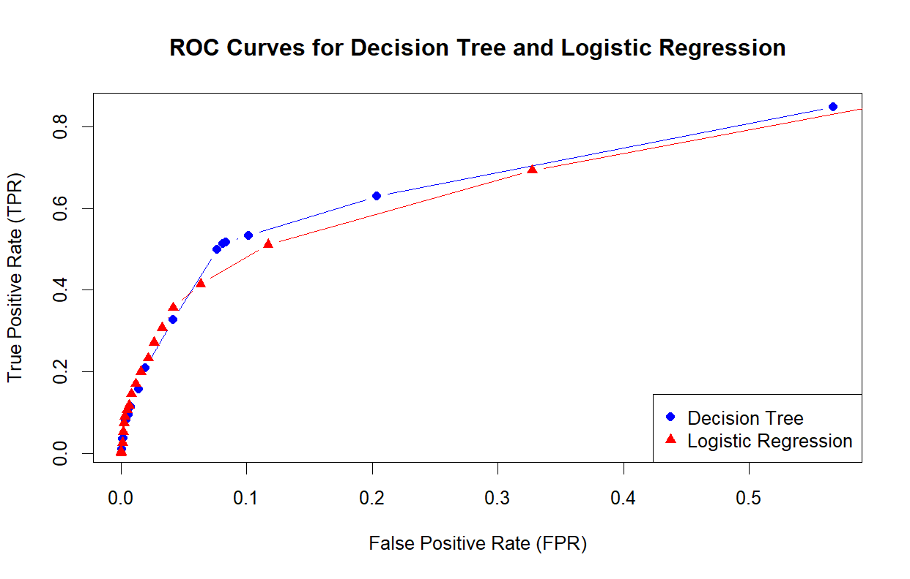

# Statement of Contribution

The contributions are distributed as follows:

Qingxuan Cui: Code on Assignment 1, analysis for assignment 2 and Question 3 from Assignment 4.

Yanjie Lyu: Code on Assignment 2, analysis for assignment 3 and Question 1 from Assignment 4.

Yi Yang: Code on Assignment 3, analysis for assignment 1 and Question 2 from Assignment 4.

After completing their respective assignments (including code writing
and analysis), all results were shared and thoroughly discussed among
the three members. The group report was created based on this
discussion.


# Assignment 1

```{r include=FALSE}
data = read.csv("data/tecator.csv")
head(data)
```

```{r include=FALSE}
dataProcessing = function(data, colnames){
    for(i in colnames)
        data[[i]] = NULL
    return(data)
}

dataSplit = function(data, proportion){
    set.seed(12345)
    n = dim(data)[1]
    id = sample(1:n,floor(n*0.5))
    train_data = data[id,]
    test_data = data[-id,]
    data_list = list()
    data_list$train = train_data
    data_list$test = test_data
    return(data_list)
}

computeMSE = function(model ,data, lambda = NULL){
    if(!is.null(lambda)){
      x = as.matrix(data[, -which(names(data) == "Fat")]) 
      y = data$Fat 
      pred = predict(model, newx = x, s = lambda)
      mse = mean((y - pred) ** 2)
    }
    else{
      pred = predict(model, data)
      mse = mean((data$Fat - pred) ** 2)
      return(mse)
    }
}
```

## Report the underlying probabilistic model and comment on the quality of fit and prediction and model.

```{r include=FALSE}
data = dataProcessing(data, c("Sample", "Protein", "Moisture"))
data_list = dataSplit(data, proportion = 0.5)
train_data = data_list$train
test_data = data_list$test

lr = lm(Fat ~ ., data = train_data)
trainMSE = computeMSE(lr, train_data)
testMSE = computeMSE(lr, test_data)
```

The probability model is:$$
  \text{Y}_i = \beta_0 + \beta_1 \cdot \text{Channel}_{1} + \beta_2 \cdot \text{Channel}_{2} + \cdots + \beta_{100} \cdot \text{Channel}_{100} + \epsilon, \quad \epsilon \sim N(0, \sigma^2)
$$


```{r echo=FALSE}
cat("The MSE of training data is:",trainMSE,"\n")
cat("The MSE of test data is:",testMSE,"\n")
```

The model performs well on the training data (MSE = 0.0057), but has a large error on the test data (MSE = 722.4294), indicating that the model cannot be generalized and there is a serious overfitting phenomenon.

## Report the cost function

```{r include=FALSE}
library(glmnet)
x_train = as.matrix(train_data[, -which(names(train_data) == "Fat")]) 
y_train = train_data$Fat  
lasso_model = glmnet(x_train, y_train, alpha = 1)

# Plot the coefficient paths
png("fig/p1_img1.png", width = 1800, height = 1200, res = 300)
plot(lasso_model, xvar = "lambda", label = TRUE)
axis(1, at = log(lasso_model$lambda), labels = floor(lasso_model$lambda)) 
```

The cost function for **LASSO regression** is defined as:

$J(\beta) = \frac{1}{2n} \sum_{i=1}^n \big(y_i - \mathbf{X}_i \cdot \beta \big)^2 + \lambda \sum_{j=1}^p |\beta_j|$

Where lambda controls the regularization strength.

## interpret LASSO Coefficient Paths Plot

\begin{figure}[h]
  \begin{minipage}{0.4\textwidth}
    1.  This graph shows the path that the regression coefficient of each feature in the **LASSO regression model** changes with the regularization parameter $\log(\lambda)$ : the horizontal axis is $\log(\lambda)$, and the vertical axis is the value of the regression coefficient for each feature.

2.  With the increase of $\lambda$ (from right to left), the regularization force is enhanced, and the coefficients of most features are compressed to 0, leaving only a few important features retaining non-zero coefficients, which realizes feature selection.
  \end{minipage}
  \hfill
  \begin{minipage}{0.5\textwidth}
    \includegraphics[width=\textwidth]{./fig/LASSO_coef.png}
  \end{minipage}
  \caption{A.1.1: LASSO Coefficient Paths}
\end{figure}


## model with only three features

```{r echo=FALSE}
# The value of lambda that results in only three non-zero features.
for (i in seq_along(lasso_model$lambda)) {
  coefs <- coef(lasso_model, s = lasso_model$lambda[i])
  non_zero_count <- sum(coefs != 0) - 1  
  if (non_zero_count == 3) {
    lambda_selected <- lasso_model$lambda[i]
    cat("Lambda with 3 non-zero coefficients:", lambda_selected, "\n")
    break
  }
}

```

```{r echo=FALSE}
coefs <- coef(lasso_model, s = lambda_selected)
coefs_selected_list <- which(coefs!=0)
coefs_selected_list <- coefs_selected_list[-1] #without intercept
coefs_selected <- coefs[coefs_selected_list,]
cat("The remaining features are:", "\n")
print(coefs_selected)

```

## Fit Ridge regression and compare the plots obtained in steps 3 and 4

\begin{figure}[H]
  \begin{minipage}{0.4\textwidth}
LASSO coefficient path diagram:

As $\lambda$ increases, the coefficients of many features are compressed to 0, and the model becomes sparse.

Ridge coefficient path map:

As $\lambda$ increases, the coefficients of all features gradually shrink, but they do not become zero.
  \end{minipage}
  \hfill
  \begin{minipage}{0.5\textwidth}
    \includegraphics[width=\textwidth]{./fig/loglambda.png}
    \caption{A.1.2: LASSO coefficient path diagram}
  \end{minipage}
\end{figure}


```{r include=FALSE}
cv_lasso = cv.glmnet(x_train, y_train, alpha = 1)
cv_scores = cv_lasso$cvm
# Load necessary libraries
library(ggplot2)

# Extract data for plotting
plot_data = data.frame(
  log_lambda = log(cv_lasso$lambda),  # Log of lambda values
  cv_scores = cv_lasso$cvm           # CV scores (MSE)
)

# Create ggplot
p3 = ggplot(plot_data, aes(x = log_lambda, y = cv_scores)) +
    geom_line(color = "black") +         # Line connecting the points
    geom_point(size = 2, color = "black") +  # Points for CV scores
    geom_vline(xintercept = log(cv_lasso$lambda.min), color = "red", linetype = "dashed", size = 1) +  # Optimal lambda line
    geom_vline(xintercept = log(cv_lasso$lambda.1se), color = "blue", linetype = "dashed", size = 1) + # 1 SE lambda line
    labs(
      title = "Dependence of CV Score on log(lambda)",
      x = "log(lambda)",
      y = "CV Score (Mean Squared Error)"
    ) +
    annotate("text", x = log(cv_lasso$lambda.min), y = min(cv_lasso$cvm)+10, 
             label = "lambda.min", color = "red", hjust = -0.2, vjust = -0.5) +
    annotate("text", x = log(cv_lasso$lambda.1se), y = min(cv_lasso$cvm)+20, 
             label = "lambda.1se", color = "blue", hjust = -0.2, vjust = -0.5) +
    theme_minimal()
ggsave("fig/p1_pic3.png", plot = p3, width = 6, height = 4, dpi = 300)

optimal_lambda = cv_lasso$lambda.min
cat("the optimal lambda: ", optimal_lambda,"\n")
coef = coef(cv_lasso, s = optimal_lambda)
var_num = sum(coef != 0) - 1
cat("the number of variables: ", var_num,"\n")

mse_optimal_lam = computeMSE(cv_lasso, test_data, lambda = optimal_lambda)
logminus4_lambda = cv_lasso$lambda[which.min(abs(log(cv_lasso$lambda) + 4))]
mse_certain_lam = computeMSE(cv_lasso, test_data, lambda = logminus4_lambda)
cat("lambda = -4, mse = ", mse_certain_lam, "\n")
cat("lambda = optimal lambda, mse = ", mse_optimal_lam, "\n")
```

## Task 5

### Dependence of the CV score on $\log(\lambda)$

\begin{figure}[h]
  \begin{minipage}{0.4\textwidth}
Dependence of CV score on $\log(\lambda)$:
As $\log(\lambda)$ increases, the CV scores increase.At the optimal $\log(\lambda)$, the cv score is the lowest, indicating the best performance. When the $\log(\lambda)$ value is large, the effect of the regularization term increases, forcing the model coefficients to shrink, leading to underfitting.
  \end{minipage}
  \hfill
  \begin{minipage}{0.5\textwidth}
    \includegraphics[width=\textwidth]{./fig/p3.png}
  \end{minipage}
  \caption{A.1.3: Dependence of CV Score on log(lambda)}
\end{figure}


### Optimal $lambda$

```{r echo=FALSE}
cat("the optimal lambda: ", optimal_lambda,"\n")
coef = coef(cv_lasso, s = optimal_lambda)
var_num = sum(coef != 0) - 1
cat("the number of variables: ", var_num,"\n")

mse_optimal_lam = computeMSE(cv_lasso, test_data, lambda = optimal_lambda)
logminus4_lambda = cv_lasso$lambda[which.min(abs(log(cv_lasso$lambda) + 4))]
mse_certain_lam = computeMSE(cv_lasso, test_data, lambda = logminus4_lambda)
cat("log_lambda = -4, mse = ", mse_certain_lam, "\n")
cat("lambda = ",optimal_lambda, "mse = ", mse_optimal_lam, "\n")
```

The difference in MSE values is very small, approximately 0.19, which is unlikely to be statistically significant.

### Scatter plot of the original test versus predicted test values

\begin{figure}[h]
  \begin{minipage}{0.4\textwidth}
The model performs well overall, as most predictions are close to the actual values.

The scatterplot shows that the model captures the general trend of the data, with no significant systematic errors.

But a few outliers at higher values suggest the model may struggle with extreme cases or higher variability in predictions for larger labels.
  \end{minipage}
  \hfill
  \begin{minipage}{0.5\textwidth}
    \includegraphics[width=\textwidth]{./fig/p4.png}
  \end{minipage}
  \caption{A.1.4: Labels in Test vs Predicted Labels}
\end{figure}


# Assignment 2
```{r include=FALSE}
library(tree)
library(rpart)
library(pROC)
data <- read.csv("data/bank-full.csv", header = TRUE, sep = ";")
data <- data[,-12]
data$y <- as.factor(data$y)
characer_col <- c()
for (i in 1:15) {
  if(is.character(data[,i])==TRUE){
    characer_col <- c(characer_col,i)
  }
}
for (col in characer_col) {
  data[,col] <- as.factor(data[,col])
}

n <- nrow(data)
set.seed(12345)
id <- sample(1:n,floor(n*0.4))
train <- data[id,]

valid_test <- data[-id,]
id_2 <- sample(1:nrow(valid_test),floor(nrow(valid_test)*0.5))
valid <- valid_test[id_2,]
test <- valid_test[-id_2,]

# default setting
bank_tree <- tree(y ~ .,data = train)

pred_default_train <- predict(bank_tree, train, type = "class")
error_default_train <- mean(pred_default_train != train$y) # Misclassfication rate of train
table(train$y,pred_default_train)

pred_default_valid <- predict(bank_tree, valid, type = "class")
error_default_valid <- mean(pred_default_valid != valid$y) # Misclassfication rate of valid
table(valid$y,pred_default_valid)

# Decision Tree with smallest allowed node size equal to 7000
bank_tree_2 <- tree(y ~ ., data = train, control = tree.control(nobs = nrow(train), minsize = 7000))

pred_2_train <- predict(bank_tree_2, train, type = "class")
error_2_train <- mean(pred_2_train != train$y) # Misclassfication rate of train
table(train$y,pred_2_train)

pred_2_valid <- predict(bank_tree_2, valid, type = "class")
error_2_valid <- mean(pred_2_valid != valid$y) # Misclassfication rate of valid
table(valid$y,pred_2_valid)

# Decision trees minimum deviance to 0.0005
bank_tree_3 <- tree(y ~ ., data = train, control = tree.control(nobs = nrow(train), mindev = 0.0005))

pred_3_train <- predict(bank_tree_3, train, type = "class")
error_3_train <- mean(pred_3_train != train$y) # Misclassfication rate of train
table(train$y,pred_2_train)

pred_3_valid <- predict(bank_tree_3, valid, type = "class")
error_3_valid <- mean(pred_3_valid != valid$y) # Misclassfication rate of valid
table(valid$y,pred_3_valid)


# task 3


trainScore = rep(0, 50)
testScore = rep(0, 50)

for (i in 2:51) {
  prunedTree <- prune.tree(bank_tree_3, best = i)
  # Predict on training and validation data
  pred_train <- predict(prunedTree, newdata = train,type = "tree")
  pred_valid <- predict(prunedTree, newdata = valid,type = "tree")
  
  # Compute deviance rates

  trainScore[i - 1] <- deviance(prunedTree)
  testScore[i - 1] <- deviance(pred_valid)

}

plot(2:50, trainScore[2:50], type="b", col="red", 
     ylim=c(7800,11850))
points(2:50, testScore[2:50], type="b", col="blue")

# find optimal size

best_size_index <- which(testScore==min(testScore))
best_size <- best_size_index + 2
optimal_tree <- prune.tree(bank_tree_3, best = best_size)

summary(optimal_tree)

# task 4
optimal_pred <- predict(optimal_tree, newdata = test, type = "class")

# confusion matrix

conf_matrix <- table( Observed = test$y,Predicted = optimal_pred)
print(conf_matrix)

# accuracy
accuracy <- sum(diag(conf_matrix)) / sum(conf_matrix)
print(paste("Accuracy:", accuracy))

# F1-score
TP <- conf_matrix["yes", "yes"]
FP <- conf_matrix["no", "yes"]
FN <- conf_matrix["yes", "no"]

precision <- TP / (TP + FP)
recall <- TP / (TP + FN)

f1_score <- 2 * (precision * recall) / (precision + recall)
print(paste("F1-score:", f1_score))

# task 5
loss_matrix <- matrix(c(0, 5, 1, 0), nrow = 2)
colnames(loss_matrix) <- c("no", "yes")
rownames(loss_matrix) <- c("no", "yes")

tree_with_loss <- rpart(y ~ ., data = train, parms = list(loss = loss_matrix))
pred_with_loss <- predict(tree_with_loss, newdata = test, type = "class")


conf_matrix_loss <- table(Observed = test$y,Predicted = pred_with_loss)
print(conf_matrix_loss)

accuracy_loss <- sum(diag(conf_matrix_loss)) / sum(conf_matrix_loss)

#F1-score with loss
TP_l <- conf_matrix_loss["yes", "yes"]
FP_l <- conf_matrix_loss["no", "yes"]
FN_l <- conf_matrix_loss["yes", "no"]

precision_l <- TP_l / (TP_l + FP_l)
recall_l <- TP_l / (TP_l + FN_l)
f1_score_loss <- 2 * (precision_l * recall_l) / (precision_l + recall_l)


# task 6

# set models
tree_pred_prob <- predict(optimal_tree, newdata = test, type = "vector")
tree_probs_yes <- tree_pred_prob[, "yes"]

log_model <- glm(y ~ ., data = train, family = "binomial")
log_pred_prob <- predict(log_model, newdata = test, type = "response")

thresholds <- seq(0.05, 0.95, by = 0.05)

tree_tpr <- tree_fpr <- log_tpr <- log_fpr <-precision_tree <- recall_tree <-  precision_log <-recall_log <-   numeric(length(thresholds)) # initiate value

for (i in seq_along(thresholds)) {
  threshold <- thresholds[i]
  
  tree_pred <- ifelse(tree_probs_yes > threshold, "yes", "no")
  tree_cm <- table(Observed = test$y, Predicted = factor(tree_pred, levels = c("no", "yes")))
  
  # compute TPR and FPR 
  tree_tpr[i] <- tree_cm["yes", "yes"] / sum(tree_cm["yes", ])
  tree_fpr[i] <- tree_cm["no", "yes"] / sum(tree_cm["no", ])
  
  # compute precision and recall
  precision_tree[i] <- tree_cm["yes", "yes"] / (tree_cm["yes", "yes"] + tree_cm["no", "yes"])
  recall_tree[i] <- tree_cm["yes", "yes"] / (tree_cm["yes", "yes"] + tree_cm["yes", "no"])
  
  # result of logistic
  log_pred <- ifelse(log_pred_prob > threshold, "yes", "no")
  log_cm <- table(Observed = test$y,Predicted = factor(log_pred, levels = c("no", "yes")))
  
  # compute TPR and FPR (logistic)
  log_tpr[i] <- log_cm["yes", "yes"] / sum(log_cm["yes", ])
  log_fpr[i] <- log_cm["no", "yes"] / sum(log_cm["no",])
  
  # compute precision and recall (logistic)
  precision_log[i] <- log_cm["yes", "yes"] / (log_cm["yes", "yes"] + log_cm["no", "yes"])
  recall_log[i] <- log_cm["yes", "yes"] / (log_cm["yes", "yes"] + log_cm["yes", "no"])
}

# Plot ROC curve for the Optimal Decision Tree
plot(tree_fpr, tree_tpr, type = "b", col = "blue", pch = 16,
     xlab = "False Positive Rate (FPR)", ylab = "True Positive Rate (TPR)",
     main = "ROC Curves for Decision Tree and Logistic Regression")

# Add ROC curve for Logistic Regression
lines(log_fpr, log_tpr, type = "b", col = "red", pch = 17)

# Add legend
legend("bottomright", legend = c("Decision Tree", "Logistic Regression"),
       col = c("blue", "red"), pch = c(16, 17))


# precision-recall curve
plot(recall_tree, precision_tree, type = "b", col = "blue", pch = 16,
     xlab = "Recall", ylab = "Precision",
     main = "Precision-Recall Curves")

# Add ROC curve for Logistic Regression
lines(recall_log, precision_log, type = "b", col = "red", pch = 17)

# Add legend
legend("bottomright", legend = c("Decision Tree", "Logistic Regression"),
       col = c("blue", "red"), pch = c(16, 17))


```

## report the misclassification rates for the training and validation data.

The misclassification rates for the training and validation data for 3 models are as follows:

```{r echo=FALSE}
train_err <- c(error_default_train,error_2_train,error_3_train)
valid_err <- c(error_default_valid,error_2_valid,error_3_valid)
df <- data.frame(
  train = train_err,
  validation = valid_err
)
name <- c("default parameters model","minsize = 7000 model","mindiv = 0.0005 model")
row.names(df) <- name
df
```


## Report how changing the deviance and node size affected the size of trees and explain why
```{r, echo=FALSE}
model_list = list(default = bank_tree, minsize = bank_tree_2, mindiv = bank_tree_3)
depth = vector()
nodes = vector()
for(i in model_list){
  depth = c(depth, max(attr(i$frame, "row.names")))
  nodes = c(nodes, nrow(i$frame))
}
default_parameters = tree.control(nobs = 1)[c("minsize", "mindev")]
report = data.frame(model_name = c("default parameters model", "minsize = 7000 model", "mindiv = 0.0005 model"),
                    mindiv = c(default_parameters$mindev, default_parameters$mindev, 0.0005),
                    minsize = c(default_parameters$minsize, 7000, default_parameters$minsize),
                    depth = depth,
                    nodes = nodes)

library(knitr)
kable(report, format = "markdown") 
```
Optimized Comment:
When comparing the model with minsize = 7000 to the default model, it is evident that increasing minsize simplifies the model by reducing its complexity. Conversely, decreasing mindiv significantly increases the size and complexity of the model by allowing finer splits.

Optimized Explanation:
The minsize parameter in a decision tree specifies the minimum number of samples required in a leaf node. As minsize increases, each leaf node must contain more samples, which restricts further splitting. This reduces the depth of the tree and simplifies the model by limiting its ability to overfit.
On the other hand, mindiv represents the minimum improvement in the splitting criterion (e.g., information gain or Gini index) required to perform a split. When mindiv decreases, the model becomes more permissive, allowing splits even with smaller improvements. This leads to deeper trees with more layers and leaf nodes, significantly increasing the model’s complexity and its capacity to capture intricate patterns in the data.


## choose the optimal tree depth in the model 2c: study the trees up to 50 leaves

\begin{figure}[H]
  \begin{minipage}{0.4\textwidth}
    1. As the number of leaves increases, the training error decreases continuously, indicating better fit to the training data.  
    
2. The validation error initially decreases but later increases, showing overfitting as the model complexity grows.  

3. The optimal number of leaves balances bias and variance, minimizing the validation error while avoiding overfitting.  
  \end{minipage}
  \hfill
  \begin{minipage}{0.5\textwidth}
    \includegraphics[width=\textwidth]{./fig/size.png}
  \end{minipage}
  \caption{A.2.1: dependence of deviances on the number of leaves}
\end{figure}

### Report the optimal amount of leaves and which variables is the most important

```{r echo=FALSE}
cat("Acccroding to Fig 5, the optimal amount of leaves is:",best_size+1)
```


### Interpret the information provided by the tree structure

\begin{figure}[H]
  \begin{minipage}{0.4\textwidth}
    From the tree structure we can observe that: 

1. "poutcome", "month", "contact", "pdays", "age", "day", "balance" and "housing" are the most important for decision making in this tree;

2. Most leaves have a classification label of no;

3. Most leaf nodes labeled yes are in the poutcome value of whether or not they fall in the abd.

 These insights suggest targeting clients with a history of positive responses, higher balances, and strategic timing (e.g., avoiding specific months) for future campaigns.
  \end{minipage}
  \hfill
  \begin{minipage}{0.5\textwidth}
    \includegraphics[width=\textwidth]{./fig/tree.png}
  \end{minipage}
  \caption{A.2.2: tree structure}
\end{figure}

\clearpage
## Comment on accuracy and F1 score for the test data by using the optimal model

```{r echo=FALSE}
print(conf_matrix)
cat("\n")
cat("The accuracy of test data is:",accuracy,"\n")
cat("The F1 score of test data is:",f1_score)
```


Performance: While the high accuracy suggests strong overall performance, the low F1-Score reveals imbalances in recall and precision, highlighting the model's struggle to correctly identify the minority class ("yes"). This discrepancy underscores the limitations of accuracy in datasets with class imbalance, where high accuracy can mask poor performance on the minority class.

Measures: Accuracy provides a general overview but is less reliable in imbalanced datasets. The F1-Score, by combining precision and recall, offers a more balanced and insightful evaluation, capturing the trade-offs in handling minority classes effectively. It is the preferred metric in this context to assess the model's true performance.

## Comment on decision tree with loss matrix

```{r echo=FALSE}
# table
performance = data.frame(accuracy = c(round(accuracy, 3), round(accuracy_loss, 3)), f1_score = c(round(f1_score, 3), round(f1_score_loss, 3)))
row.names(performance) = c("optimal tree", "tree with loss matrix")
colnames(performance) = c("accuracy", "F1-Score")
knitr::kable(performance, format = "markdown")
```
Comparison:

The accuarcy is lower while F1-Socre is higher based on the table below.

Explanation:

The loss matrix skews the tree's decision threshold with higher penalty for false negatives and lower penalty for false positives.

Accuracy is calculated as $\frac{\text{TP} + \text{TN}}{\text{Total Samples}}$.

With the loss matrix, the model becomes more aggressive in predicting "yes" to minimize the high cost of false negatives. This can lead to
increased false positives (FP), reducing TN, and thereby lowering accuracy.

The F1-Score is given by $2 \times \frac{\text{Precision} \times \text{Recall}}{\text{Precision} + \text{Recall}}$.

Precision improves as true positives increase and the increase in false positives is relatively small.

Recall improves significantly due to fewer false negatives.
Since F1-score prioritizes the performance on the positive class, it increases even if accuracy drops.


## ROC analysis

```{r echo=FALSE, fig.cap="A.2.3: ROC", out.width="80%"}
library(knitr)


```

Explanation:
The ROC curve plots False Positive Rate (FPR) on the x-axis and True Positive Rate (TPR) on the y-axis, where:
$$
TPR = \frac{TP}{TP + FN}
$$

$$
FPR = \frac{FP}{FP + TN}
$$
When the dataset contains fewer positive labels (class imbalance), the behavior of TPR and FPR changes significantly:
Since TPR is affected by the denominator TP+FN, a small number of positive labels (low TP+FN) amplifies the impact of False Negatives (FN). Even a small increase in FN leads to a noticeable drop in TPR, making it sensitive to imbalance.
FPR is calculated using the denominator FP+TN, which depends on the number of negative labels. In the case of fewer positive labels, negative labels dominate the dataset, making FP+TN very large. This reduces the impact of False Positives (FP) on FPR, making it relatively insensitive to imbalance.
Unlike the ROC curve, Precision-Recall Curve focuses on the trade-off between precision and recall, which directly reflects the model's ability to identify the positive class accurately and it is more insightful for evaluating performance on imbalanced datasets, as it highlights the impact of incorrect predictions (FP and FN) on the minority class.


# Assignment 3

```{r include=FALSE}
communities <- read.csv("data/communities.csv")

#task 1
#scale data except of `ViolentCrimesPerPop`
scaled <- scale(communities[,-which(names(communities)=="ViolentCrimesPerPop")],center=TRUE,scale=TRUE)

#compute eigenvectors and eigenvalues
covariance<- cov(scaled)

#extract eigenvectors and eigenvalues
eigen <- eigen(covariance)
eigen_values <- eigen$values
eigen_vectors <- eigen$vectors


#compute total variance
variance <- sum(eigen_values)

#compute contribution of each component
propotion_variance <- eigen_values/variance


#compute cumulative variance proportion
cumulative_var <- cumsum(propotion_variance)


#numbers of components to obtain 95% variance
index1 <-min(which(cumulative_var>0.95))
cat("At least ",index1,"components to obtain a 95% of variance in the data.")

#the proportion of variance explained by each of the first two principal component.
first_com_proportion <- propotion_variance[1]
second_com_proportion <- propotion_variance[2]
cat("The proportion of variance of explained by each of the two principal components:\n")
cat("The first components: ",first_com_proportion ,"\n")
cat("The second components: ",second_com_proportion,"\n")


#task 2
library(ggplot2)

#using princomp
prin <- princomp(scaled)

#extract the first principle component
first_com_prin <- prin$scores[,1]

#make the trace plot of the first principle component


scree_data <- data.frame(
  Component = 1:length(eigen_values),
  Variance_Explained = propotion_variance
)

ggplot(scree_data, aes(x= Component, y=Variance_Explained)) +
  geom_line()+
  geom_point()+
  ggtitle("trace plot")+
  xlab("Principal Component")+
  ylab("Variance_Explained(%)")+
  theme_minimal()

#Do many features have a notable contribution to this component

#Top 5 features contribute mostly
first_com_contribute <- prin$loadings[,1]
first_com_contribute_df <- data.frame(
  Feature=names(first_com_contribute),
  contribution=first_com_contribute,
  contribution_Abs=abs(first_com_contribute)
)
#extract top 5 features 
top_5_features <- first_com_contribute_df$Feature[order(first_com_contribute_df$contribution_Abs,decreasing = TRUE)[1:5]]
cat("Top 5 features that contributed mostly to the first principle component: ",top_5_features,".\n")


#Relationship to crime level

#medFamInc:median family income (differs from household income for non-family households
#medIncome:median household income 
#PctKids2Par: percentage of kids in family housing with two parents
#pctWInvInc:percentage of households with investment / rent income in 1989
#PctPopUnderPov:percentage of people under the poverty level

# Conclusion: These five features mainly describes the following aspects: 1.Median family income;2.Median household income;3.Percentage of kids in family housing with two parents;4.Percentage of households with investment / rent income;5.Percentage of people under the poverty level.
#All five features are related to family property and household wealth levels.The logical relationship to  crime levels is that  families with fewer financial resources or  more children(which increases financial budget)may be more likely to resort to illegal activities to obtain money.Financial stress within household may be a significant factor contributing to crime level. 


#Plot the pc scores in the coordinates(PC1,PC2)
second_com_prin <- prin$scores[,2]
fir_sec_prin_df <- data.frame(
  PC1=first_com_prin,
  PC2=second_com_prin,
  ViolentCrimesPerPop=communities$ViolentCrimesPerPop
)
ggplot(fir_sec_prin_df,aes(x=PC1,y=PC2,color=ViolentCrimesPerPop))+
  geom_point()+
  scale_color_viridis_c()+
  labs(tittle="PC scores in the coordinates(PC1,PC2)",X="PC1",y="PC2",color="ViolentCrimesPerPop")+
  theme_minimal()
  
#task3
#split the data(50/50)
library(caret)
set.seed(12345)
n <- nrow(communities)
id <- sample(1:n,floor(n*0.5))
train <- communities[id,]
test <- communities[-id,]

scaler <- preProcess(train)
trainS <- predict(scaler,train)
testS <- predict(scaler,test)

#fit the model using scaled training data
fit <- lm(ViolentCrimesPerPop~.-1,data=trainS)

predictions_train <- predict(fit,newdata=trainS)
predictions_test <- predict(fit,newdata=testS)

#MSE for training and test data
MSE_training <- mean((trainS$ViolentCrimesPerPop-predictions_train)^2)
MSE_test <- mean((testS$ViolentCrimesPerPop-predictions_test)^2)
cat("MSE for the training data is :",MSE_training,"\n")
cat("MSE for the test data is :",MSE_test,"\n")

#Comment on the quality of model
R2 <- summary(fit)$r.squared
cat("The R^2 value for the model is: ",R2,"\n")

#Comment:The Mean Squared Error (MSE) for the training data is 0.2752071, indicating that the model performs well on the training set. However, the MSE for the test data is 0.4248011, which is higher than the training data MSE. This suggests that the model may be overfitting, as it performs worse and may not generalize as well on unseen data . The R² value is 0.7245166, meaning that the model explains approximately 72.4% of the variance in the target variable. 

#task4
#implement cost function without intercept
costfunction <- function(theta,training_X,training_y,test_X,test_y){
  #compute the mean squared error
  train_error<- mean((training_X%*%theta-training_y)^2)
  test_error <- mean((test_X%*%theta-test_y)^2)
  return(c(train_error,test_error))
}

training_X <- as.matrix(trainS[,-101])
training_y <- trainS$ViolentCrimesPerPop

test_X <- as.matrix(testS[,-101])
test_y <- testS$ViolentCrimesPerPop

#optimize theta and compute mse
theta_initial <- rep(0,ncol(training_X))


#create a df to store errors each iteration
errors_iteration_df <- data.frame(
  iteration=integer(),
  train_errors=numeric(),
  test_errors=numeric()
)

optim_theta <- optim(par=theta_initial,
                     fn=function(theta){
                       #compute training and test errors for each iteration
                       errors <- costfunction(theta,training_X,training_y,test_X,test_y)
                       
                       #store the errors 
                       errors_iteration_df <<- rbind(errors_iteration_df,data.frame(
                         iteration=nrow(errors_iteration_df)+1,
                         train_errors=errors[1],
                         test_errors=errors[2]
                       ))
                       
                       #return training errors since `optim()` uses training error 
                       return(errors[1])
                       
                     },
                    control = list(maxit=3000),
                     method = "BFGS")
#print(errors_itteration_df)

#plot showing the dependence if both errors on the iteration number

ggplot(errors_iteration_df[errors_iteration_df$iteration >500,],aes(x=iteration))+   #discard the first 500 iterations to make it visible
  geom_line(aes(y=train_errors,color="Training Errors"))+
  geom_line(aes(y=test_errors,color="Test Errors"))+
  labs(title = "Training and test error during aech iteration",x="Iteration number",y="Errors")+
  scale_color_manual(values = c("blue","red"))+
  scale_y_continuous(limits = c(0, 1.2), breaks = seq(0, 1.2, by = 0.2)) +
  theme_minimal()+
  theme(plot.title = element_text(hjust = 0.5))


#find optimal iteration
index <- which.min(errors_iteration_df[,3])
cat("The optimal iteration number is:",index,"\n")

#extract training and test error at optimal iteration
optimail_train_errors <- errors_iteration_df[index,2]
optimai_test_errors <- errors_iteration_df[index,3]


cat("Training error at optimal iteration",optimail_train_errors,"\n")
cat("Test error at optimal iteration",optimai_test_errors,"\n")

```

## Task 1

```{r echo=FALSE}
cat("At least ",index1,"components to obtain a 95% of variance in the data.")

```

```{r echo=FALSE}
cat("The proportion of variance of explained by each of the two principal components:\n")
cat("The first components: ",first_com_proportion ,"\n")
cat("The second components: ",second_com_proportion,"\n")
```

## Task 2

### Trace plot of the first principle component.

\begin{figure}[H]
  \begin{minipage}{0.4\textwidth}
    1.Notable Contribution: Only a few features (those contributing to the first few principal components) have a notable contribution to the variance. The majority of features have minimal impact.
    
    2.Dimensionality Reduction: This suggests that most of the variability in the data can be captured using just the first few principal components, which implies that many features do not have a notable individual contribution to the overall variance.
  \end{minipage}
  \hfill
  \begin{minipage}{0.5\textwidth}
    \includegraphics[width=\textwidth]{./fig/tracep.png}
  \end{minipage}
  \caption{A.3.1: Trace plot}
\end{figure}

### Top 5 contributing features

```{r echo=FALSE}
cat("Top 5 features that contributed mostly to the first principle component: ","\n",top_5_features,".\n")
```

Conclusion:

These five features mainly describes the following aspects:

1.Median family income; 2.Median household income; 3.Percentage of kids in family housing with two parents; 4.Percentage of households with investment / rent income; 5.Percentage of people under the poverty level.

All five features are related to family property and household wealth levels. The logical relationship to crime levels is that families with fewer financial resources or more children (which increases financial budget) may be more likely to resort to illegal activities to obtain money. Financial stress within household may be a significant factor contributing to crime level.

### Plot of the PC scores in the coordinates (PC1, PC2)

```{r echo=FALSE}
ggplot(fir_sec_prin_df,aes(x=PC1,y=PC2,color=ViolentCrimesPerPop))+
  geom_point()+
  scale_color_viridis_c()+
  labs(tittle="PC scores in the coordinates(PC1,PC2)",X="PC1",y="PC2",color="ViolentCrimesPerPop")+
  theme_minimal()
```

1.  The score of the data point on the first principal component (PC1) is significantly positively correlated with the violent crime rate ("ViolentCrimesPerPop"), which tends to increase when PC1 increases (yellow).

2.  The second principal component (PC2) has a weak ability to distinguish the violent crime rate, and the distribution of data points in this direction is relatively symmetrical, and there is no obvious pattern.

3.  The overall arc distribution of the data indicates that there may be a nonlinear relationship, and further analysis of the characteristic contribution of PC1 is needed to understand the key factors affecting the violent crime rate.

## Task 3

After training the linear regression model:

```{r echo=FALSE}
cat("MSE for the training data is :",MSE_training,"\n")
cat("MSE for the test data is :",MSE_test,"\n")
cat("The R^2 value for the model is: ",R2,"\n")
```

1.  The MSE of the model on the training data is 0.275, and the MSE on the test data is 0.425. The test error is slightly higher but generally close, indicating that the model is stable and the degree of overfitting is low.

2.  The coefficient of determination R² is 0.725, indicating that the model can explain 72.5% of the variance of violent crime rate, but 27.5% of the variation is still unexplained.

3.  A slight increase in the test error may indicate the need to optimize features or introduce regularization methods to further improve the generalization ability of the model.

## Task 4

```{r echo=FALSE}
ggplot(errors_iteration_df[errors_iteration_df$iteration >500,],aes(x=iteration))+   #discard the first 500 iterations to make it visible
  geom_line(aes(y=train_errors,color="Training Errors"))+
  geom_line(aes(y=test_errors,color="Test Errors"))+
  labs(title = "Training and test error during aech iteration",x="Iteration number",y="Errors")+
  scale_color_manual(values = c("blue","red"))+
  scale_y_continuous(limits = c(0, 1.2), breaks = seq(0, 1.2, by = 0.2)) +
  theme_minimal()+
  theme(plot.title = element_text(hjust = 0.5))


#find optimal iteration
index <- which.min(errors_iteration_df[,3])
cat("The optimal iteration number is:",index,"\n")

#extract training and test error at optimal iteration
optimail_train_errors <- errors_iteration_df[index,2]
optimai_test_errors <- errors_iteration_df[index,3]


cat("Training error at optimal iteration",optimail_train_errors,"\n")
cat("Test error at optimal iteration",optimai_test_errors,"\n")

cat("MSE for the training data from linear regression is :",MSE_training,"\n")
cat("MSE for the test data from linear regression is :",MSE_test,"\n")
```

Conclusion:
Using `optim` function with `BFGS` method for optimization, we got the higher MSE for training data but lower MSE for test data compared to the linear regression model. It indicates that early stopping criterion  helps us prevent overfitting on the training data and achieves a better generalization performance despite potentially compromising some fit on the training data.


# Assignment 4. Theory

## What are the practical approaches for reducing the expected new data error, according to the book?

To achieve minimal $E_{new}$, according to the decomposition $E_{new}$ = $E_{train}$ $+$ generalization gap, we need to have $E_{train}$ as well as the generalization gap small.

1. Increasing the size of the training data to reduce the generalization gap and $E_{new}$;

2. If $E_{hold-out}$ $\approx$ $E_{train}$ (small generalization gap; possibly underfitting), it might be beneficial to increase the model flexibility by loosening the regularization, increasing the model order (more parameters to learn), etc.

3. If $E_{train}$ is close to zero and $E_{hold-out}$ is not (possibly overfitting), it might be beneficial to decrease the model flexibility by tightening the regularization, decreasing the order (fewer parameters to learn), etc.

(page 66-67)

## What important aspect should be considered when selecting minibatches, according to the book? 

1.It's important to ensure the different mini-batches are balanced and representative for the whole dataset.If we have a few different output classes and the dataset is sorted with respect to the output, the mini-batch with the first n data points would only include one class and not give a good approximation of the gradient for the full dataset.

2.The mini-batches should be formed randomly. To ensure each mini-batch with representativeness, the training data should be shuffled randomly before diving into mini-batches. And after completing one epoch, the dataset should be reshuffled before another epoch.

(page 125)

## Provide an example of modifications in a loss function and in data that can be done to take into account the data imbalance, according to the book.

Modification in the loss function
To reflect that not predicting y=1 correctly is a 'C times more severe mistake' than not predicting y=-1 correctly, the misclassification loss can be modified into：
$$
L(y, \hat{y}) =
\begin{cases} 
0, & \text{if } \hat{y} = y, \\ 
1, & \text{if } \hat{y} \neq y \text{ and } y = -1, \\ 
C, & \text{if } \hat{y} \neq y \text{ and } y = 1.
\end{cases}
$$
The similar effect can be achieved by duplicating all positive training data points C times in the training data instead of modifying the loss function.

(page 100-101)


# Appendix

## Code for Assignment 1

```{r, echo=TRUE, eval=FALSE}
data = read.csv("data/tecator.csv")
head(data)

dataProcessing = function(data, colnames){
  for(i in colnames)
    data[[i]] = NULL
  return(data)
}

dataSplit = function(data, proportion){
  set.seed(12345)
  n = dim(data)[1]
  id = sample(1:n,floor(n*0.5))
  train_data = data[id,]
  test_data = data[-id,]
  data_list = list()
  data_list$train = train_data
  data_list$test = test_data
  return(data_list)
}

computeMSE = function(model ,data, lambda = NULL){
  if(!is.null(lambda)){
    x = as.matrix(data[, -which(names(data) == "Fat")]) 
    y = data$Fat 
    pred = predict(model, newx = x, s = lambda)
    mse = mean((y - pred) ** 2)
  }
  else{
    pred = predict(model, data)
    mse = mean((data$Fat - pred) ** 2)
    return(mse)
  }
}

data = dataProcessing(data, c("Sample", "Protein", "Moisture"))
data_list = dataSplit(data, proportion = 0.5)
train_data = data_list$train
test_data = data_list$test

lr = lm(Fat ~ ., data = train_data)
trainMSE = computeMSE(lr, train_data)
testMSE = computeMSE(lr, test_data)

library(glmnet)
x_train = as.matrix(train_data[, -which(names(train_data) == "Fat")]) 
y_train = train_data$Fat  
lasso_model = glmnet(x_train, y_train, alpha = 1)

# Plot the coefficient paths
png("fig/p1_img1.png", width = 1800, height = 1200, res = 300)
plot(lasso_model, xvar = "lambda", label = TRUE)
axis(1, at = log(lasso_model$lambda), labels = floor(lasso_model$lambda)) 

plot(lasso_model, xvar = "lambda", label = TRUE)
title(main = "LASSO Coefficient Paths")

# The value of lambda that results in only three non-zero features.
for (i in seq_along(lasso_model$lambda)) {
  coefs <- coef(lasso_model, s = lasso_model$lambda[i])
  non_zero_count <- sum(coefs != 0) - 1  
  if (non_zero_count == 3) {
    lambda_selected <- lasso_model$lambda[i]
    cat("Lambda with 3 non-zero coefficients:", lambda_selected, "\n")
    break
  }
}

coefs <- coef(lasso_model, s = lambda_selected)
coefs_selected_list <- which(coefs!=0)
coefs_selected_list <- coefs_selected_list[-1] #without intercept
coefs_selected <- coefs[coefs_selected_list,]
cat("The remaining features are:", "\n")
print(coefs_selected)

ridge_model = glmnet(x_train, y_train, alpha = 0)

plot(ridge_model, xvar = "lambda", label = TRUE)
axis(1, at = log(ridge_model$lambda), labels = floor(ridge_model$lambda)) 

cv_lasso = cv.glmnet(x_train, y_train, alpha = 1)
cv_scores = cv_lasso$cvm
# Load necessary libraries
library(ggplot2)

# Extract data for plotting
plot_data = data.frame(
  log_lambda = log(cv_lasso$lambda),  # Log of lambda values
  cv_scores = cv_lasso$cvm           # CV scores (MSE)
)

# Create ggplot
p3 = ggplot(plot_data, aes(x = log_lambda, y = cv_scores)) +
  geom_line(color = "black") +         # Line connecting the points
  geom_point(size = 2, color = "black") +  # Points for CV scores
  geom_vline(xintercept = log(cv_lasso$lambda.min), color = "red", linetype = "dashed", size = 1) +  # Optimal lambda line
  geom_vline(xintercept = log(cv_lasso$lambda.1se), color = "blue", linetype = "dashed", size = 1) + # 1 SE lambda line
  labs(
    title = "Dependence of CV Score on log(lambda)",
    x = "log(lambda)",
    y = "CV Score (Mean Squared Error)"
  ) +
  annotate("text", x = log(cv_lasso$lambda.min), y = min(cv_lasso$cvm)+10, 
           label = "lambda.min", color = "red", hjust = -0.2, vjust = -0.5) +
  annotate("text", x = log(cv_lasso$lambda.1se), y = min(cv_lasso$cvm)+20, 
           label = "lambda.1se", color = "blue", hjust = -0.2, vjust = -0.5) +
  theme_minimal()
ggsave("fig/p1_pic3.png", plot = p3, width = 6, height = 4, dpi = 300)

optimal_lambda = cv_lasso$lambda.min
cat("the optimal lambda: ", optimal_lambda,"\n")
coef = coef(cv_lasso, s = optimal_lambda)
var_num = sum(coef != 0) - 1
cat("the number of variables: ", var_num,"\n")

mse_optimal_lam = computeMSE(cv_lasso, test_data, lambda = optimal_lambda)
logminus4_lambda = cv_lasso$lambda[which.min(abs(log(cv_lasso$lambda) + 4))]
mse_certain_lam = computeMSE(cv_lasso, test_data, lambda = logminus4_lambda)
cat("lambda = -4, mse = ", mse_certain_lam, "\n")
cat("lambda = optimal lambda, mse = ", mse_optimal_lam, "\n")

cat("the optimal lambda: ", optimal_lambda,"\n")
coef = coef(cv_lasso, s = optimal_lambda)
var_num = sum(coef != 0) - 1
cat("the number of variables: ", var_num,"\n")

mse_optimal_lam = computeMSE(cv_lasso, test_data, lambda = optimal_lambda)
logminus4_lambda = cv_lasso$lambda[which.min(abs(log(cv_lasso$lambda) + 4))]
mse_certain_lam = computeMSE(cv_lasso, test_data, lambda = logminus4_lambda)
cat("log_lambda = -4, mse = ", mse_certain_lam, "\n")
cat("lambda = ",optimal_lambda, "mse = ", mse_optimal_lam, "\n")

y_test = test_data$Fat
x_test = test_data[, -which(names(test_data) == "Fat")]
y_pred = predict(cv_lasso, s = optimal_lambda, newx = as.matrix(x_test))

p4 = ggplot(data = cbind(y_test, y_pred), mapping = aes(x = y_test, y = y_pred)) +
  geom_point(size = 2) +
  geom_abline(intercept = 0, slope = 1, linetype = "dashed", color = "red", linewidth = 1) +
  labs(title = "Labels in Test vs Predicted Labels",
       x = "Labels in Test",
       y = "Predicted Labels") +
  theme_minimal()


```
## Code for Assignment 2

```{r, echo=TRUE, eval=FALSE}
library(tree)
library(rpart)
library(pROC)
data <- read.csv("data/bank-full.csv", header = TRUE, sep = ";")
data <- data[,-12]
data$y <- as.factor(data$y)
characer_col <- c()
for (i in 1:15) {
  if(is.character(data[,i])==TRUE){
    characer_col <- c(characer_col,i)
  }
}
for (col in characer_col) {
  data[,col] <- as.factor(data[,col])
}

n <- nrow(data)
set.seed(12345)
id <- sample(1:n,floor(n*0.4))
train <- data[id,]

valid_test <- data[-id,]
id_2 <- sample(1:nrow(valid_test),floor(nrow(valid_test)*0.5))
valid <- valid_test[id_2,]
test <- valid_test[-id_2,]

# default setting
bank_tree <- tree(y ~ .,data = train)

pred_default_train <- predict(bank_tree, train, type = "class")
error_default_train <- mean(pred_default_train != train$y) # Misclassfication rate of train
table(train$y,pred_default_train)

pred_default_valid <- predict(bank_tree, valid, type = "class")
error_default_valid <- mean(pred_default_valid != valid$y) # Misclassfication rate of valid
table(valid$y,pred_default_valid)

# Decision Tree with smallest allowed node size equal to 7000
bank_tree_2 <- tree(y ~ ., data = train, control = tree.control(nobs = nrow(train), minsize = 7000))

pred_2_train <- predict(bank_tree_2, train, type = "class")
error_2_train <- mean(pred_2_train != train$y) # Misclassfication rate of train
table(train$y,pred_2_train)

pred_2_valid <- predict(bank_tree_2, valid, type = "class")
error_2_valid <- mean(pred_2_valid != valid$y) # Misclassfication rate of valid
table(valid$y,pred_2_valid)

# Decision trees minimum deviance to 0.0005
bank_tree_3 <- tree(y ~ ., data = train, control = tree.control(nobs = nrow(train), mindev = 0.0005))

pred_3_train <- predict(bank_tree_3, train, type = "class")
error_3_train <- mean(pred_3_train != train$y) # Misclassfication rate of train
table(train$y,pred_2_train)

pred_3_valid <- predict(bank_tree_3, valid, type = "class")
error_3_valid <- mean(pred_3_valid != valid$y) # Misclassfication rate of valid
table(valid$y,pred_3_valid)


# task 3


trainScore = rep(0, 50)
testScore = rep(0, 50)

for (i in 2:51) {
  prunedTree <- prune.tree(bank_tree_3, best = i)
  # Predict on training and validation data
  pred_train <- predict(prunedTree, newdata = train,type = "tree")
  pred_valid <- predict(prunedTree, newdata = valid,type = "tree")
  
  # Compute deviance rates

  trainScore[i - 1] <- deviance(prunedTree)
  testScore[i - 1] <- deviance(pred_valid)

}

plot(2:50, trainScore[2:50], type="b", col="red", 
     ylim=c(7800,11850))
points(2:50, testScore[2:50], type="b", col="blue")

# find optimal size

best_size_index <- which(testScore==min(testScore))
best_size <- best_size_index + 3
optimal_tree <- prune.tree(bank_tree_3, best = best_size)

summary(optimal_tree)

# task 4
optimal_pred <- predict(optimal_tree, newdata = test, type = "class")

# confusion matrix

conf_matrix <- table( Observed = test$y,Predicted = optimal_pred)
print(conf_matrix)

# accuracy
accuracy <- sum(diag(conf_matrix)) / sum(conf_matrix)
print(paste("Accuracy:", accuracy))

# F1-score
TP <- conf_matrix["yes", "yes"]
FP <- conf_matrix["no", "yes"]
FN <- conf_matrix["yes", "no"]

precision <- TP / (TP + FP)
recall <- TP / (TP + FN)

f1_score <- 2 * (precision * recall) / (precision + recall)
print(paste("F1-score:", f1_score))

# task 5
loss_matrix <- matrix(c(0, 5, 1, 0), nrow = 2)
colnames(loss_matrix) <- c("no", "yes")
rownames(loss_matrix) <- c("no", "yes")

tree_with_loss <- rpart(y ~ ., data = train, parms = list(loss = loss_matrix))
pred_with_loss <- predict(tree_with_loss, newdata = test, type = "class")


conf_matrix_loss <- table(Observed = test$y,Predicted = pred_with_loss)
print(conf_matrix_loss)

accuracy_loss <- sum(diag(conf_matrix_loss)) / sum(conf_matrix_loss)

#F1-score with loss
TP_l <- conf_matrix_loss["yes", "yes"]
FP_l <- conf_matrix_loss["no", "yes"]
FN_l <- conf_matrix_loss["yes", "no"]

precision_l <- TP_l / (TP_l + FP_l)
recall_l <- TP_l / (TP_l + FN_l)
f1_score_loss <- 2 * (precision_l * recall_l) / (precision_l + recall_l)


# task 6

# set models
tree_pred_prob <- predict(optimal_tree, newdata = test, type = "vector")
tree_probs_yes <- tree_pred_prob[, "yes"]

log_model <- glm(y ~ ., data = train, family = "binomial")
log_pred_prob <- predict(log_model, newdata = test, type = "response")

thresholds <- seq(0.05, 0.95, by = 0.05)

tree_tpr <- tree_fpr <- log_tpr <- log_fpr <-precision_tree <- recall_tree <-  precision_log <-recall_log <-   numeric(length(thresholds)) # initiate value

for (i in seq_along(thresholds)) {
  threshold <- thresholds[i]
  
  tree_pred <- ifelse(tree_probs_yes > threshold, "yes", "no")
  tree_cm <- table(Observed = test$y, Predicted = factor(tree_pred, levels = c("no", "yes")))
  
  # compute TPR and FPR 
  tree_tpr[i] <- tree_cm["yes", "yes"] / sum(tree_cm["yes", ])
  tree_fpr[i] <- tree_cm["no", "yes"] / sum(tree_cm["no", ])
  
  # compute precision and recall
  precision_tree[i] <- tree_cm["yes", "yes"] / (tree_cm["yes", "yes"] + tree_cm["no", "yes"])
  recall_tree[i] <- tree_cm["yes", "yes"] / (tree_cm["yes", "yes"] + tree_cm["yes", "no"])
  
  # result of logistic
  log_pred <- ifelse(log_pred_prob > threshold, "yes", "no")
  log_cm <- table(Observed = test$y,Predicted = factor(log_pred, levels = c("no", "yes")))
  
  # compute TPR and FPR (logistic)
  log_tpr[i] <- log_cm["yes", "yes"] / sum(log_cm["yes", ])
  log_fpr[i] <- log_cm["no", "yes"] / sum(log_cm["no",])
  
  # compute precision and recall (logistic)
  precision_log[i] <- log_cm["yes", "yes"] / (log_cm["yes", "yes"] + log_cm["no", "yes"])
  recall_log[i] <- log_cm["yes", "yes"] / (log_cm["yes", "yes"] + log_cm["yes", "no"])
}

# Plot ROC curve for the Optimal Decision Tree
plot(tree_fpr, tree_tpr, type = "b", col = "blue", pch = 16,
     xlab = "False Positive Rate (FPR)", ylab = "True Positive Rate (TPR)",
     main = "ROC Curves for Decision Tree and Logistic Regression")

# Add ROC curve for Logistic Regression
lines(log_fpr, log_tpr, type = "b", col = "red", pch = 17)

# Add legend
legend("bottomright", legend = c("Decision Tree", "Logistic Regression"),
       col = c("blue", "red"), pch = c(16, 17))


# precision-recall curve
plot(recall_tree, precision_tree, type = "b", col = "blue", pch = 16,
     xlab = "Recall", ylab = "Precision",
     main = "Precision-Recall Curves")

# Add ROC curve for Logistic Regression
lines(recall_log, precision_log, type = "b", col = "red", pch = 17)

# Add legend
legend("bottomright", legend = c("Decision Tree", "Logistic Regression"),
       col = c("blue", "red"), pch = c(16, 17))


```
## Code for Assignment 3

```{r, echo=TRUE, eval=FALSE}
communities <- read.csv("data/communities.csv")

#task 1
#scale data except of `ViolentCrimesPerPop`
scaled <- scale(communities[,-which(names(communities)=="ViolentCrimesPerPop")],center=TRUE,scale=TRUE)

#compute eigenvectors and eigenvalues
covariance<- cov(scaled)

#extract eigenvectors and eigenvalues
eigen <- eigen(covariance)
eigen_values <- eigen$values
eigen_vectors <- eigen$vectors


#compute total variance
variance <- sum(eigen_values)

#compute contribution of each component
propotion_variance <- eigen_values/variance


#compute cumulative variance proportion
cumulative_var <- cumsum(propotion_variance)


#numbers of components to obtain 95% variance
index1 <-min(which(cumulative_var>0.95))
cat("At least ",index1,"components to obtain a 95% of variance in the data.")

#the proportion of variance explained by each of the first two principal component.
first_com_proportion <- propotion_variance[1]
second_com_proportion <- propotion_variance[2]
cat("The proportion of variance of explained by each of the two principal components:\n")
cat("The first components: ",first_com_proportion ,"\n")
cat("The second components: ",second_com_proportion,"\n")


#task 2
library(ggplot2)

#using princomp
prin <- princomp(scaled)

#extract the first principle component
first_com_prin <- prin$scores[,1]

#make the trace plot of the first principle component


scree_data <- data.frame(
  Component = 1:length(eigen_values),
  Variance_Explained = propotion_variance
)

ggplot(scree_data, aes(x= Component, y=Variance_Explained)) +
  geom_line()+
  geom_point()+
  ggtitle("trace plot")+
  xlab("Principal Component")+
  ylab("Variance_Explained(%)")+
  theme_minimal()

#Do many features have a notable contribution to this component

#Top 5 features contribute mostly
first_com_contribute <- prin$loadings[,1]
first_com_contribute_df <- data.frame(
  Feature=names(first_com_contribute),
  contribution=first_com_contribute,
  contribution_Abs=abs(first_com_contribute)
)
#extract top 5 features 
top_5_features <- first_com_contribute_df$Feature[order(first_com_contribute_df$contribution_Abs,decreasing = TRUE)[1:5]]
cat("Top 5 features that contributed mostly to the first principle component: ",top_5_features,".\n")


#Relationship to crime level

#medFamInc:median family income (differs from household income for non-family households
#medIncome:median household income 
#PctKids2Par: percentage of kids in family housing with two parents
#pctWInvInc:percentage of households with investment / rent income in 1989
#PctPopUnderPov:percentage of people under the poverty level

# Conclusion: These five features mainly describes the following aspects: 1.Median family income;2.Median household income;3.Percentage of kids in family housing with two parents;4.Percentage of households with investment / rent income;5.Percentage of people under the poverty level.
#All five features are related to family property and household wealth levels.The logical relationship to  crime levels is that  families with fewer financial resources or  more children(which increases financial budget)may be more likely to resort to illegal activities to obtain money.Financial stress within household may be a significant factor contributing to crime level. 


#Plot the pc scores in the coordinates(PC1,PC2)
second_com_prin <- prin$scores[,2]
fir_sec_prin_df <- data.frame(
  PC1=first_com_prin,
  PC2=second_com_prin,
  ViolentCrimesPerPop=communities$ViolentCrimesPerPop
)
ggplot(fir_sec_prin_df,aes(x=PC1,y=PC2,color=ViolentCrimesPerPop))+
  geom_point()+
  scale_color_viridis_c()+
  labs(tittle="PC scores in the coordinates(PC1,PC2)",X="PC1",y="PC2",color="ViolentCrimesPerPop")+
  theme_minimal()
  
#task3
#split the data(50/50)
library(caret)
set.seed(12345)
n <- nrow(communities)
id <- sample(1:n,floor(n*0.5))
train <- communities[id,]
test <- communities[-id,]

scaler <- preProcess(train)
trainS <- predict(scaler,train)
testS <- predict(scaler,test)

#fit the model using scaled training data
fit <- lm(ViolentCrimesPerPop~.-1,data=trainS)

predictions_train <- predict(fit,newdata=trainS)
predictions_test <- predict(fit,newdata=testS)

#MSE for training and test data
MSE_training <- mean((trainS$ViolentCrimesPerPop-predictions_train)^2)
MSE_test <- mean((testS$ViolentCrimesPerPop-predictions_test)^2)
cat("MSE for the training data is :",MSE_training,"\n")
cat("MSE for the test data is :",MSE_test,"\n")

#Comment on the quality of model
R2 <- summary(fit)$r.squared
cat("The R^2 value for the model is: ",R2,"\n")

#Comment:The Mean Squared Error (MSE) for the training data is 0.2752071, indicating that the model performs well on the training set. However, the MSE for the test data is 0.4248011, which is higher than the training data MSE. This suggests that the model may be overfitting, as it performs worse and may not generalize as well on unseen data . The R² value is 0.7245166, meaning that the model explains approximately 72.4% of the variance in the target variable. 

#task4
#implement cost function without intercept
costfunction <- function(theta,training_X,training_y,test_X,test_y){
  #compute the mean squared error
  train_error<- mean((training_X%*%theta-training_y)^2)
  test_error <- mean((test_X%*%theta-test_y)^2)
  return(c(train_error,test_error))
}

training_X <- as.matrix(trainS[,-101])
training_y <- trainS$ViolentCrimesPerPop

test_X <- as.matrix(testS[,-101])
test_y <- testS$ViolentCrimesPerPop

#optimize theta and compute mse
theta_initial <- rep(0,ncol(training_X))


#create a df to store errors each iteration
errors_iteration_df <- data.frame(
  iteration=integer(),
  train_errors=numeric(),
  test_errors=numeric()
)

optim_theta <- optim(par=theta_initial,
                     fn=function(theta){
                       #compute training and test errors for each iteration
                       errors <- costfunction(theta,training_X,training_y,test_X,test_y)
                       
                       #store the errors 
                       errors_iteration_df <<- rbind(errors_iteration_df,data.frame(
                         iteration=nrow(errors_iteration_df)+1,
                         train_errors=errors[1],
                         test_errors=errors[2]
                       ))
                       
                       #return training errors since `optim()` uses training error 
                       return(errors[1])
                       
                     },
                    control = list(maxit=3000),
                     method = "BFGS")
#print(errors_itteration_df)

#plot showing the dependence if both errors on the iteration number

ggplot(errors_iteration_df[errors_iteration_df$iteration >500,],aes(x=iteration))+   #discard the first 500 iterations to make it visible
  geom_line(aes(y=train_errors,color="Training Errors"))+
  geom_line(aes(y=test_errors,color="Test Errors"))+
  labs(title = "Training and test error during aech iteration",x="Iteration number",y="Errors")+
  scale_color_manual(values = c("blue","red"))+
  scale_y_continuous(limits = c(0, 1.2), breaks = seq(0, 1.2, by = 0.2)) +
  theme_minimal()+
  theme(plot.title = element_text(hjust = 0.5))


#find optimal iteration
index <- which.min(errors_iteration_df[,3])
cat("The optimal iteration number is:",index,"\n")

#extract training and test error at optimal iteration
optimail_train_errors <- errors_iteration_df[index,2]
optimai_test_errors <- errors_iteration_df[index,3]


cat("Training error at optimal iteration",optimail_train_errors,"\n")
cat("Test error at optimal iteration",optimai_test_errors,"\n")
```

